# LevelDB: Read the Fucking Source Code.

## by grakra

----

## TOC

- **Example**
- **Overiew**
- **LSM**
- **WAL**
- **DB manipulation**

>
- **Write**
- **Compaction**
- **Read**

- **Open**

----

`Code version: 1.19   3080a45 Increase leveldb version to 1.19.`

----

## Example

### build leveldb library

> 
	make -j 4 -B
	
### demo

> 
	#include <cassert>
	#include <iostream>
	using std::cerr;
	using std::cout;
	using std::endl;
>	
	#include <string>
	using std::string;
>	
	#include <algorithm>
	using std::transform;
>	
	#include <functional>
	using std::ptr_fun;
>	
	#include <cctype>
>	
	#include "leveldb/db.h"
>	
	int main () {
	    leveldb::DB* db;
	    leveldb::Options options;
	    options.create_if_missing = true;
	    //options.error_if_exists = true;
	    leveldb::Status s = leveldb::DB::Open(options, "/tmp/testdb", &db);
	    if (!s.ok()) {
	        cerr << s.ToString() <<endl;
	        exit(1);
	    }
>	
	    string key1="foobar";
>	
	    s = db->Put(leveldb::WriteOptions(), key1, "1");
	    cout <<"stat:"<<s.ToString()<<endl;
>	
	    leveldb::ReadOptions options1;
	    options1.snapshot = db->GetSnapshot();
	    string value1;
	    s = db->Get(options1, key1, &value1);
	    cout <<"stat:"<<s.ToString()<<endl;
	    cout <<"value="<<value1<<endl;
>	
	    s = db->Put(leveldb::WriteOptions(), key1, "111");
	    cout <<"stat:"<<s.ToString()<<endl;
	    value1.resize(0);
	    s = db->Get(leveldb::ReadOptions(), key1, &value1);
	    cout <<"stat:"<<s.ToString()<<endl;
	    cout <<"value="<<value1<<endl;
>	
	    value1.resize(0);
	    s = db->Get(options1, key1, &value1);
	    cout <<"stat:"<<s.ToString()<<endl;
	    cout <<"value="<<value1<<endl;
>	
	    if (db != nullptr ) {
	        delete db;
	    }
	    cout <<"delete db"<<endl;
	    return 0;
	}

### Build Demo

> 
	g++ -g -O0 -rdynamic -std=c++0x -static -L out-static -I include/ -o demo demo.cc  -lleveldb -lpthread

## Overview

### Features

1. KeyValue
2. Persistent
3. Embedded
4. Snapshot isolation
5. Thread-safety
6. Configurable
7. High-performance (https://github.com/google/leveldb)

### Inventory of data directory

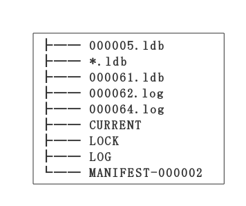

### Architecture


-----

## LSM (Log-Structured Merge tree)

`O’Neil P, Cheng E, Gawlick D, et al. The log-structured merge-tree (LSM-tree)[J]. Acta Informatica, 1996, 33(4): 351-385.`
	
-----

## WAL (Write-Ahead Logging)


### sketch of WAL

**WHY**

> 
- WAL is essential of standalone local storage systems.
- standalone local storage system is substantialization of WAL.
- WAL guarantees that committed data survive in power outages and process crashes.
- WAL is key to ACIDity of transaction processing.
- Data rate of sequential access is about three orders of magnitude higher than counterpart of random access.

**HOW**

**Stonebraker** says:

> 
	1. Each modification to a database page should generate a log record, and the log record must be flushed to the log device before the database page is flushed.
> 	
	2. Database log records must be flushed in order; log record r cannot be flushed until all log records preceding r are flushed.
> 
	3. Upon a transaction commit request, a commit log record must be flushed to the log device before the commit request returns successfully.
> 
	------------------------ Architecture of a Database System

**[Lin, W., & Yang, M. (2008). PacificA : Replication in Log-Based Distributed Storage Systems](http://research.microsoft.com/pubs/66814/tr-2008-25.pdf)**
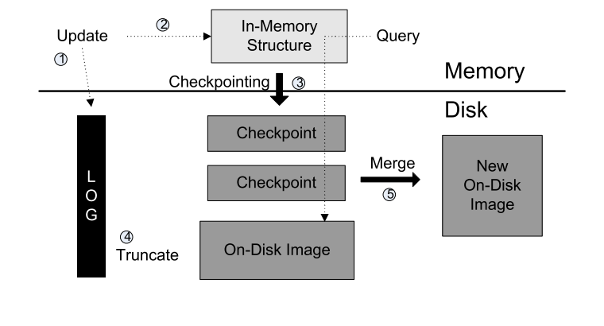

----

### WAL in LevelDB

#### **features**

- Log records separate from its payload.(**abstraction**)
- Log writers/readers separate from underlying file operations.(**portability**)
- WAL is used to make both db data and db metadata persistent. 

#### **log format**	

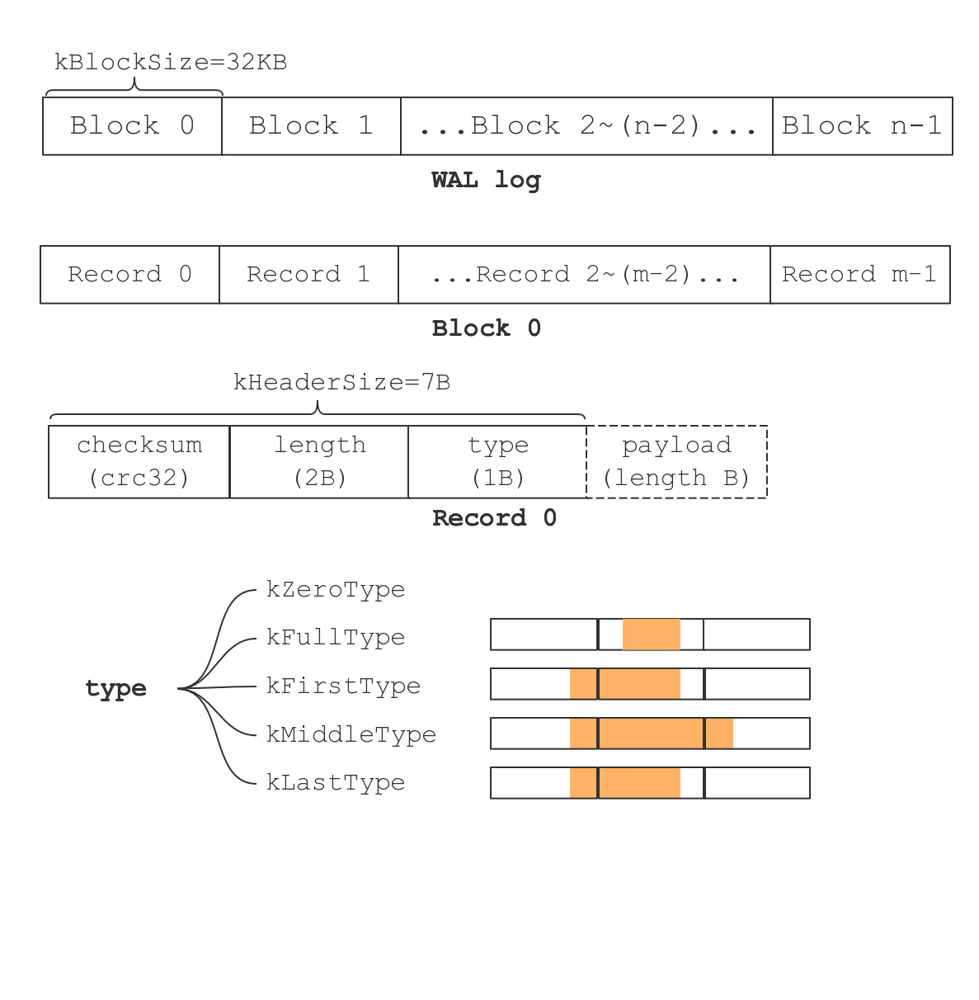

- a log is AOF that consists of  several blocks which are fixed-size except last one.
- a block is a contiguous range that is composes of log record.
- a blob being appended to the log may cross borders of blocks. a cross-border blob is segmented into one kFirstType records, zero or more kMiddleType records and one kLastType records.
- a non-cross-border blob is kFullType.
- if a block remains 7B, then a empty record is appended to the block. 
- if a block remains less than 7B, then a trailor (zero paddings) is appended.
- kZeroType records are generated by RandomAccessFile that built upon mmap syscall.**n/a**.

#### **implementation**

**log format definition**

> 
	db/dbformat.h
	db/dbformat.cc


**log::Reader**

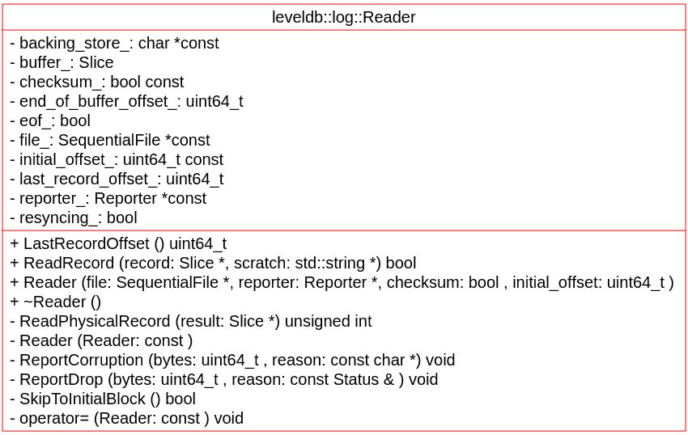

> 
	db/log_reader.h
	db/log_reader.cc


**log::Writer**

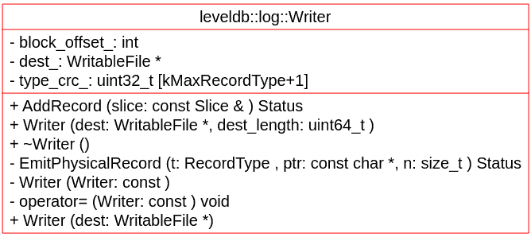

> 
	db/log_writer.h 
	db/log_writer.cc


**underlying file operations**

Abstract class(include/leveldb/env.h) | Implementation(util/env_posix.cc)| usage
--------------------------------------------------|-----------------------------------------------|---------
**WritableFile** | **PosixWritableFile**("w", fwrite) | backbone of **TableBuilder**(writing SSTable)
**AppendableFile** | **PosixAppendableFile**("a", fwrite) | backbone of Log::Writer
**SequentialFile** | **PosixSequentialFile("r", fread)** | backbone of **Log::Reader**
**RandomAccessFile** | **PosixMmapReadableFile**(O_RDONLY, mmap)| backbone of **Table**(reading SSTable), prefered if running on 64-bit platforms and the mmap slots(1000) are not hausted. 
**RandomAccessFile** | **PosixRandomAccessFile**(O_RDONLY, pread)| backbone of **Table**(reading SSTable), used if mmap is not allowed.


**DB Data Manipulation**

> 
**log record payload**


> 
**commit log record**
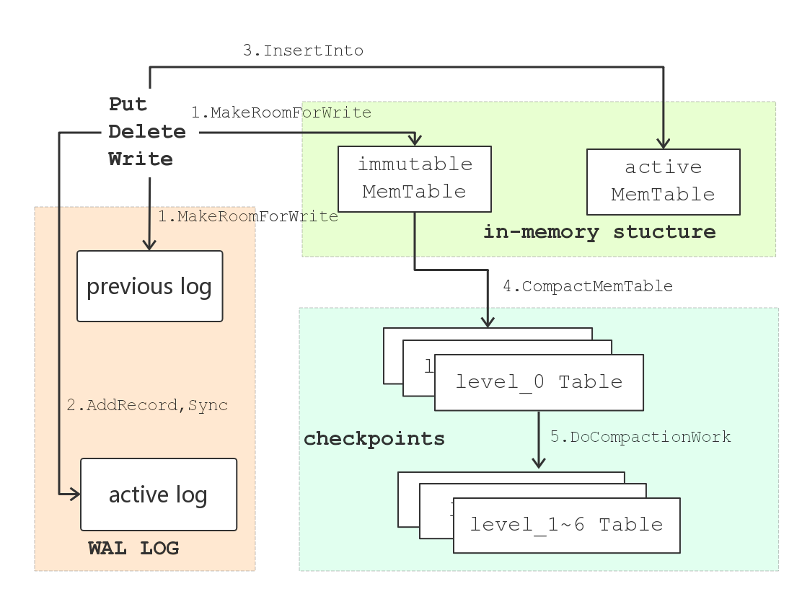

> 
**data/control flow**
	
> 
-  **step1: invoke DB::{Put, Delete, Write} to manipulate db**

> 
		Status DB::Put(const WriteOptions& opt, const Slice& key, const Slice& value) {
		  WriteBatch batch;
		  batch.Put(key, value);
		  return Write(opt, &batch);
		}
> 		
		Status DB::Delete(const WriteOptions& opt, const Slice& key) {
		  WriteBatch batch;
		  batch.Delete(key);
		  return Write(opt, &batch);
		}

>  
- **step2: convert operands and opcodes into WriteBatch and Write**

> 
		db/db_impl.cc-1193 Status DBImpl::Write(const WriteOptions& options, WriteBatch* my_batch)

> 
- **step3: a Writer object made of WriteBatch is pushed onto the back of the Writer queue.**
	
> 
		// db/db_impl.cc-1194 Write
		  Writer w(&mutex_);
		  w.batch = my_batch;
		  w.sync = options.sync;
		  w.done = false;
> 		
		  MutexLock l(&mutex_);
		  writers_.push_back(&w);
		  while (!w.done && &w != writers_.front()) {
		    w.cv.Wait();
		  }
		  if (w.done) {
		    return w.status;
		  }

> 
- **step4:  invoke function MakeRoomForWrite to attempt to switch log**

> 
		db/db_impl.cc-1209 Write

> 
1. slow down write speed,
2. switch log,
3. trigger background CompactMemTable task(minor compaction),
4. trigger background DoCompactionWork task(major compaction).

> 
- **step5: invoke function BuildBatchGroup for group commit**
	
> 
		// db/db_impl.cc-1213 Write
		    WriteBatch* updates = BuildBatchGroup(&last_writer);
		    WriteBatchInternal::SetSequence(updates, last_sequence + 1);
		    last_sequence += WriteBatchInternal::Count(updates);

> 	
- **step6: invoke function AddRecord to flush operation records to the log**

> 
		// db/db_impl.cc-1223 Write
		      status = log_->AddRecord(WriteBatchInternal::Contents(updates));
		      bool sync_error = false;
		      if (status.ok() && options.sync) {
		        status = logfile_->Sync();
		        if (!status.ok()) {
		          sync_error = true;
		        }
		      }

> 
- **step7: invoke funtion InsertInto to apply new operation records to MemTable**
	
> 
		// db/db_impl.cc-1232 Write
		        status = WriteBatchInternal::InsertInto(updates, mem_);

> 
- **step8: return on success or failure**


**DB Metadata Manipulation**

> 
**VersionSet records in-core metadata**

> 
- **next file number**: monotonic increasing number for naming log, table and MANIFEST file.
- **log file number**: specify current WAL that keeps db data operations.
- **previous log file number**: previous log file corresponding to immutable MemTable.
- **last sequnence number**: monotonic increasing number  assigned to db operations, like timestamp, KeyValue with greater sequence number is newer then the counterpart with less sequence number.
- **compact pointers**: the file from which the next compaction starts in each level.
- **current Version**: keep files that each level owns.

> 
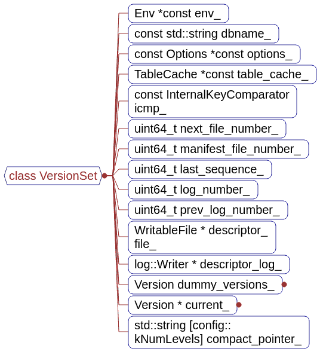
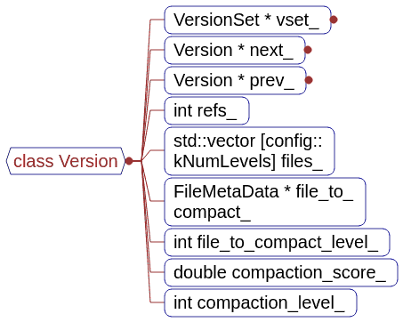

> 
**MANIFEST file is WAL log that stores metadata operation records**

> 
**CURRENT file stores filename of the current MANIFEST file**

> 
**Modify VersionSet**
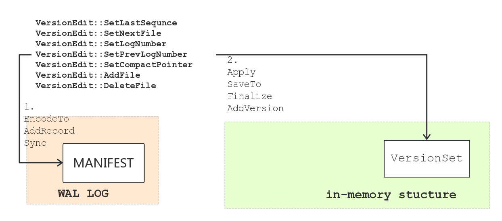
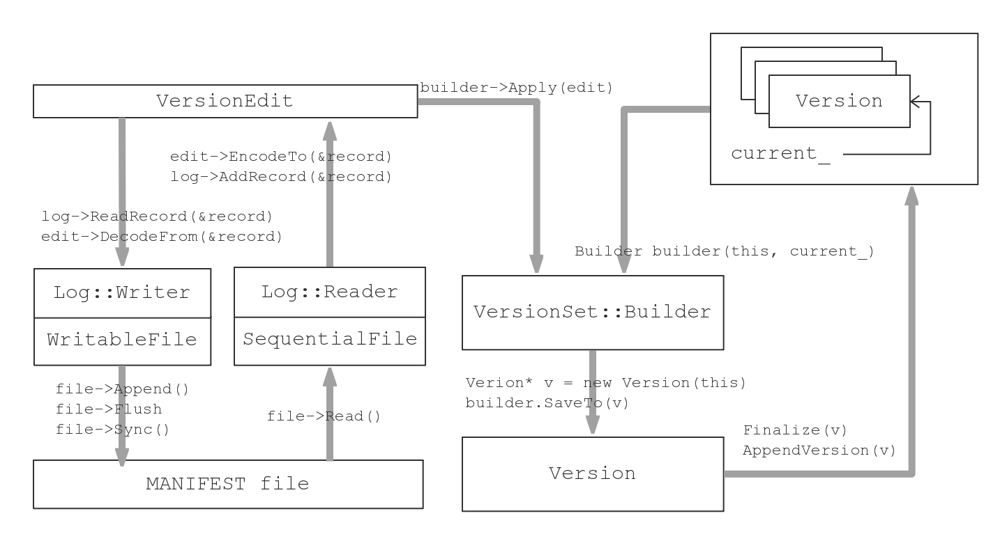	

----

## DB manipulation

----

### 1.Write

**key points**

- **Put**, **Delete** and **Write** invocations are canonicalized into uniform **Write** invocations.
-  operation records are appended to **WAL log** before they are applyed to **MemTable**.

HOW to write WAL log is detailed in the previous sections, thus, only MemTable operations are depicted below.

**source files**

> 
	db/memtable.h
	db/memtable.cc
	db/skiplist.h
	util/arena.h
	util/arena.cc

#### **MemTable**	

**brief introduction to MemTable**

- A MemTable instance consists of a SkipList  instance and a Arena instance(memory allocator).
- SkipList is insertable, non-deleteable.
- SkipList is not thread-safe, so callers (member  functions of SkipList are callees) should guarantee synchronization by IPC utilities.
- Only one writer is allowed to mutate SkipList.
- When the writer enters critical region, mulitple readers  are also allowed read SkipList.
- Arena is a memory allocator, which allocates a new page by c++ `new operator` when the old page allocated previously is ran out,  then allocate small pieces from the page for storing SkipList nodes.

**MemTable member**

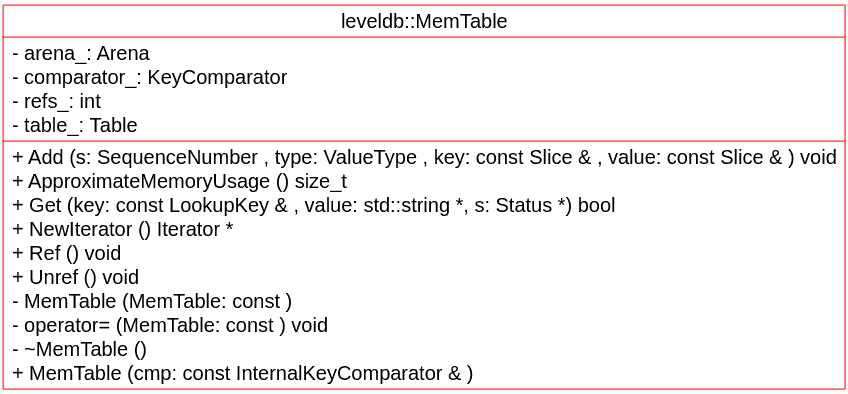

**SkipList member**

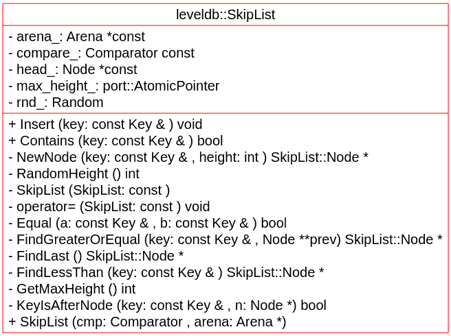
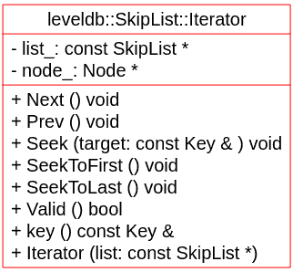

**MemTable Entry**

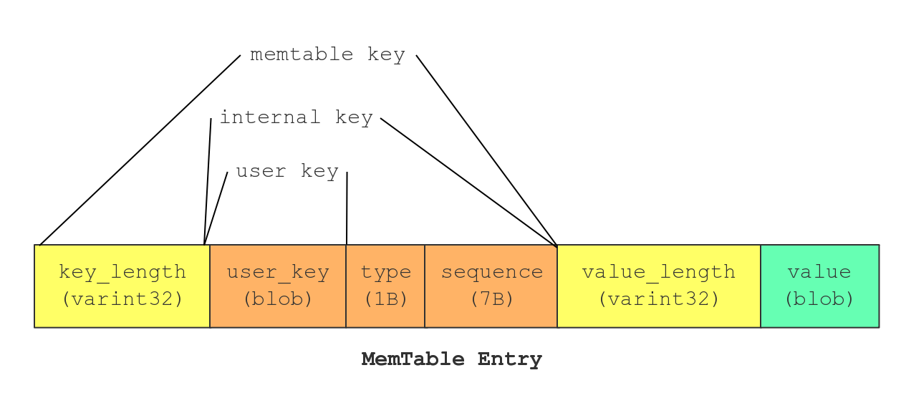

> 
	// db/memtable.cc-82
	void MemTable::Add(SequenceNumber s, ValueType type,
	                   const Slice& key,
	                   const Slice& value) {
	  // Format of an entry is concatenation of:
	  //  key_size     : varint32 of internal_key.size()
	  //  key bytes    : char[internal_key.size()]
	  //  value_size   : varint32 of value.size()
	  //  value bytes  : char[value.size()]
	  size_t key_size = key.size();
	  size_t val_size = value.size();
	  size_t internal_key_size = key_size + 8;
	  const size_t encoded_len =
	      VarintLength(internal_key_size) + internal_key_size +
	      VarintLength(val_size) + val_size;
	  char* buf = arena_.Allocate(encoded_len);
	  char* p = EncodeVarint32(buf, internal_key_size);
	  memcpy(p, key.data(), key_size);
	  p += key_size;
	  EncodeFixed64(p, (s << 8) | type);
	  p += 8;
	  p = EncodeVarint32(p, val_size);
	  memcpy(p, value.data(), val_size);
	  assert((p + val_size) - buf == encoded_len);
	  table_.Insert(buf);
	}

#### SkipList

**SkipList Data Structure**

**skiplist contains (0.5, 1, 1.5, 2, 3 and 3.5)**

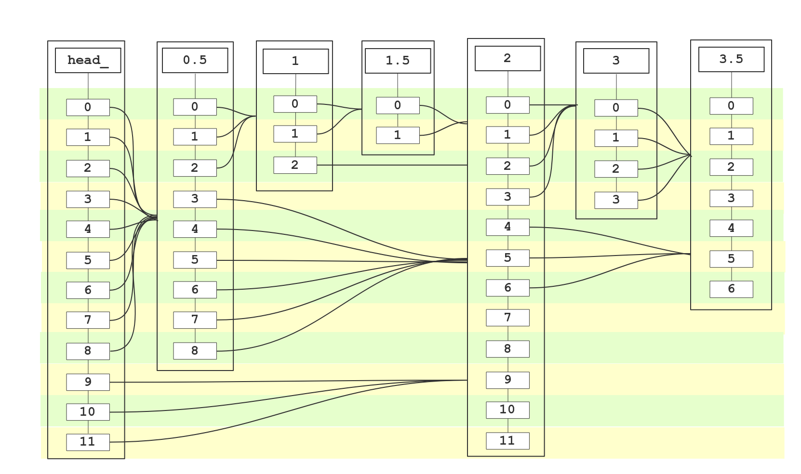

**after inserting 1.7**

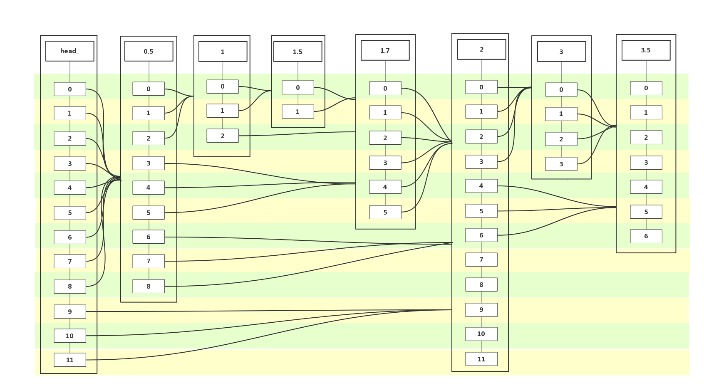

**key points on SkipList**

- The code of SkipList is handful, but the update rule of SkipList is somewhat obscure.
- However, turn the algorithm into a graph, it's very intuitive.
- SkipList is ordered unidirectional linked list consists of several nodes that contain a payload, a randomized height and next pointers whose number equals to the height.
- In MemTable, the payload of SkipList node is the MemTable entry.
- If SkipList node's height is N, then the node has N levels each of which has a next pointer.
- The next pointer in each level of the node points to the nearest node whom it can "see" in the front of iteself. the higher nodes would hide the lower counterparts.
- When lookup some key, start with the highest level of the dummy node `head_`, if the next node in the current level is less than the key, then walk forward; otherwise walk upward(i.e. level--); finally, return the node until level equals to 0. **`db/skiplist.h:262 FindGreaterOrEqual`**

**KeyComparator**

> 
	// db/memtable.cc-33
	int MemTable::KeyComparator::operator()(const char* aptr, const char* bptr)
	    const {
	  // Internal keys are encoded as length-prefixed strings.
	  Slice a = GetLengthPrefixedSlice(aptr);
	  Slice b = GetLengthPrefixedSlice(bptr);
	  return comparator.Compare(a, b);
	}
> 
	// db/memtable.cc-14
	static Slice GetLengthPrefixedSlice(const char* data) {
	  uint32_t len;
	  const char* p = data;
	  p = GetVarint32Ptr(p, p + 5, &len);  // +5: we assume "p" is not corrupted
	  return Slice(p, len);
	}
> 
	// db/dbformat.cc-50
	int InternalKeyComparator::Compare(const Slice& akey, const Slice& bkey) const {
	  // Order by:
	  //    increasing user key (according to user-supplied comparator)
	  //    decreasing sequence number
	  //    decreasing type (though sequence# should be enough to disambiguate)
	  int r = user_comparator_->Compare(ExtractUserKey(akey), ExtractUserKey(bkey));
	  if (r == 0) {
	    const uint64_t anum = DecodeFixed64(akey.data() + akey.size() - 8);
	    const uint64_t bnum = DecodeFixed64(bkey.data() + bkey.size() - 8);
	    if (anum > bnum) {
	      r = -1;
	    } else if (anum < bnum) {
	      r = +1;
	    }
	  }
	  return r;
	}
> 
	// util/comparator.cc-25 BytewiseComparatorImpl
	  virtual int Compare(const Slice& a, const Slice& b) const {
	    return a.compare(b);
	  }
	

**MemTable operations**

- **Add**: SkipList.Insert
- **Get**: SkipList::Iterator.Seek
- **MemTable::Interator**: just wark forward along level 0 of SkipList

----

### 2.Compaction

**key points of Compaction**

- **Minor compaction**: dump a immutable MemTable into a SSTable on disk.
- **Major compaction**: merge lower sparse SSTables into upper dense SSTables.
- An active MemTable is sealed and becomes immutable when the predicate `mem_->ApproximateMemoryUsage() <= options_.write_buffer_size`  is not holden(`db/db_impl.cc:1341`). `write_buffer_size` is 4MB in default.
- An Immutable MemTable should be dumped onto disk before DB switchs a new log and open up a new MemTable, so the memory may hold two MemTable, the one is sealed, the other is active. Obsolete MemTables may be postponed to release if someone is reading them.
- there is only one backgroup thread that do campacting.

**synchronize foreground CRUD threads and the background compaction thread**

- Readers never wait for background compaction thread, only writers wait.
- the foreground threads and the background thread are synchronzed by mutex and condition variable.(`man thread.h`)

**MakeRoomForWrite wait completion of compactions**
	
> 
	// db/db_impl.cc-1317
	Status DBImpl::MakeRoomForWrite(bool force) {
	  mutex_.AssertHeld();
	  assert(!writers_.empty());
	  bool allow_delay = !force;
	  Status s;
	  while (true) {
	    if (!bg_error_.ok()) {
	      // Yield previous error
	      s = bg_error_;
	      break;
	    } else if ( 
	        allow_delay &&
	        versions_->NumLevelFiles(0) >= config::kL0_SlowdownWritesTrigger) {
	      // We are getting close to hitting a hard limit on the number of
	      // L0 files.  Rather than delaying a single write by several
	      // seconds when we hit the hard limit, start delaying each
	      // individual write by 1ms to reduce latency variance.  Also,
	      // this delay hands over some CPU to the compaction thread in
	      // case it is sharing the same core as the writer.
	      mutex_.Unlock();
	      env_->SleepForMicroseconds(1000);
	      allow_delay = false;  // Do not delay a single write more than once
	      mutex_.Lock();
	    } else if (!force &&
	               (mem_->ApproximateMemoryUsage() <= options_.write_buffer_size)) {
	      // There is room in current memtable
	      break;
	    } else if (imm_ != NULL) {
	      // We have filled up the current memtable, but the previous
	      // one is still being compacted, so we wait.
	      Log(options_.info_log, "Current memtable full; waiting...\n");
	      bg_cv_.Wait();
	    } else if (versions_->NumLevelFiles(0) >= config::kL0_StopWritesTrigger) {
	      // There are too many level-0 files.
	      Log(options_.info_log, "Too many L0 files; waiting...\n");
	      bg_cv_.Wait();
	    } else {
	      // Attempt to switch to a new memtable and trigger compaction of old
	      assert(versions_->PrevLogNumber() == 0);
	      uint64_t new_log_number = versions_->NewFileNumber();
	      WritableFile* lfile = NULL;
	      s = env_->NewWritableFile(LogFileName(dbname_, new_log_number), &lfile);
	      if (!s.ok()) {
	        // Avoid chewing through file number space in a tight loop.
	        versions_->ReuseFileNumber(new_log_number);
	        break;
	      }    
	      delete log_;
	      delete logfile_;
	      logfile_ = lfile;
	      logfile_number_ = new_log_number;
	      log_ = new log::Writer(lfile);
	      imm_ = mem_;
	      has_imm_.Release_Store(imm_);
	      mem_ = new MemTable(internal_comparator_);
	      mem_->Ref();
	      force = false;   // Do not force another compaction if have room
	      MaybeScheduleCompaction();
	    }    
	  }
	  return s;
	}

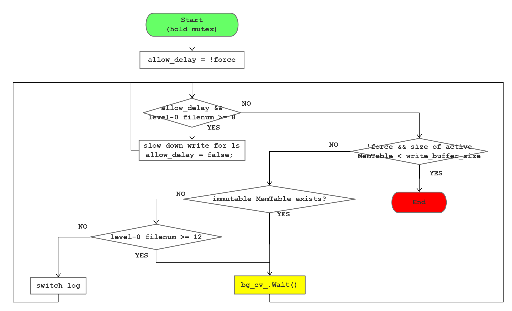
	  

**background compaction thread**

> 
	db/db_impl.cc-685 void DBImpl::BackgroundCompaction()
	db/db_impl.cc-666 void DBImpl::BackgroundCall()
	db/db_impl.cc-662 void DBImpl::BGWork(void* db)
	db/db_impl.cc-658 env_->Schedule(&DBImpl::BGWork, this);
	db/db_impl.cc-644 void DBImpl::MaybeScheduleCompaction()


**BackgroundCompaction function do the compaction finally**

- Minor compaction take precedence over major compaction.
- Minor compaction invokes `CompactMemTable`(`db/db_impl.cc-689`).
- Major compaction first invokes `VersionSet::PickCompaction`(`db/db_impl.cc-710`), then invokes `DoCompactionWork`(`db/db_impl.cc-738`)

#### **LevelDB SSTable Layout**

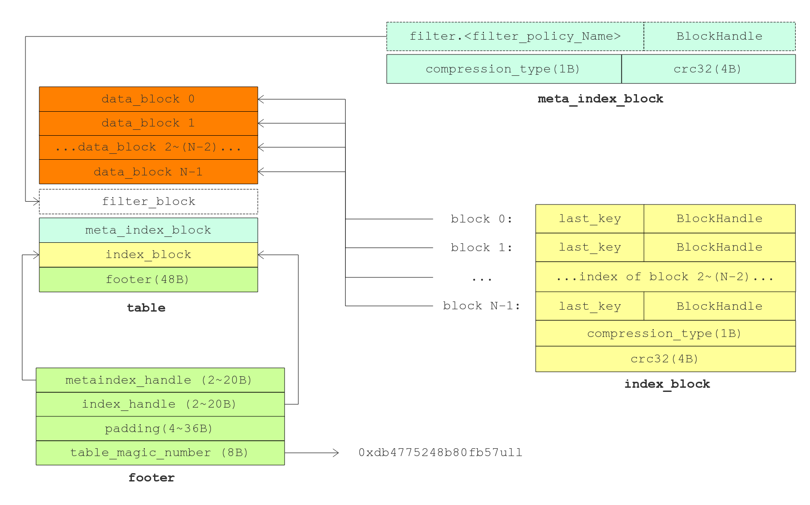
- A SSTable contains several data blocks, one index block, one meta index block, one optional filter block and a footer.

> 
	include/leveldb/table_builder.h
	table/table_builder.cc

**data block layout**

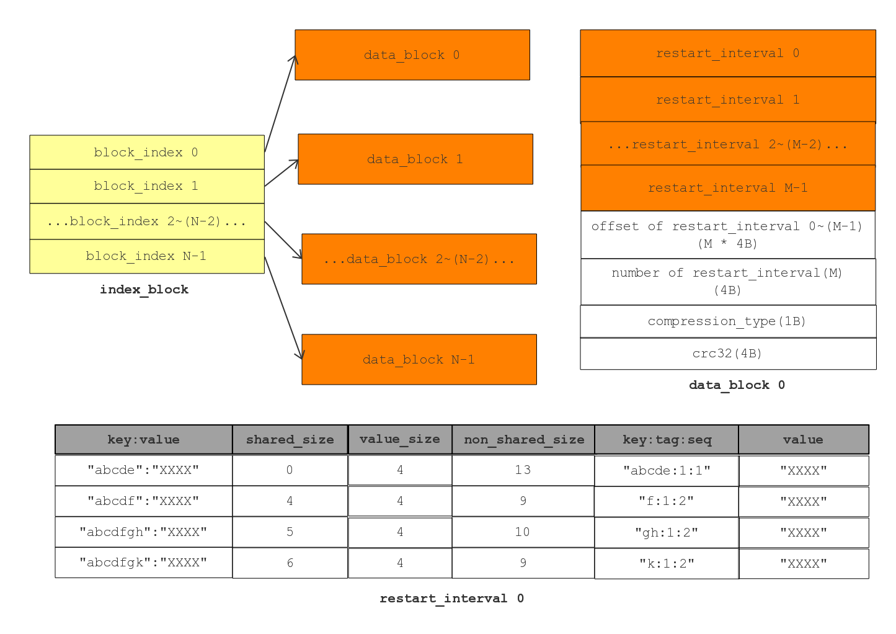

- A data block contains sorted KeyValue pairs.
- Index block and meta index block are special data blocks
- A data blocks splited into restart intervals in every 16 adjacent keys.
- In a restart interval, keys adopt a fashion of delta encoding.
- Delta encoding: given a certain key, split it into two parts, the one part is longest common prefix of itself and the previous key, which called shared part; the other part is non-shared part, so just use triple tuple (size of shared part, size of non-shared part, non-shared part) to represent the key. both sizes are stored as varint32.


> 
	table/block_builder.h
	table/block_builder.cc

**filter block layout**


- a filter is created for every 2KB.
- a data block maximum size approximates to 4KB, snappy is used to compress data block. so a persistent data block in SSTable may be less than 2KB, or more than 4KB, thus multiple data blocks may be mapped into one filter.

> 
	table/filter_block.h
	table/filter_block.cc
	util/bloom.cc


#### **When to do compaction**

**MaybeScheduleCompaction function submits compaction task to the thread**

> 
	// db/db_impl.cc:644
	void DBImpl::MaybeScheduleCompaction() {
	  mutex_.AssertHeld();
	  if (bg_compaction_scheduled_) {
	    // Already scheduled
	  } else if (shutting_down_.Acquire_Load()) {
	    // DB is being deleted; no more background compactions
	  } else if (!bg_error_.ok()) {
	    // Already got an error; no more changes
	  } else if (imm_ == NULL &&
	             manual_compaction_ == NULL &&
	             !versions_->NeedsCompaction()) {
	    // No work to be done
	  } else {
	    bg_compaction_scheduled_ = true;
	    env_->Schedule(&DBImpl::BGWork, this);
	  }
	}

**the time to launch compaction task**

**Operation**|**file-number**|**explanation**
---------------------|-----------------------|------------
Get | db/db_impl.cc-1147 | after read an Key-Value pair
Write | db/db_impl.cc-1374| after created a new MemTable 
RecordReadSample | db/db_impl.cc-1170| after walked througth several KeyValue pairs
BackgroundCall | db/db_impl.cc-681 | after the background thread has complete the previous compaction task.
Open | db/db_impl.cc-1521|  when open and recover LevelDB.


#### **Minor compaction: CompactMemTable**

**key points**

- Minor compaction dumps a sealed MemTable to a SSTable on disk, add the new SSTable to a new current Version, and delete obsolete logs and MemTables.
- Minor compaction takes priority over majar compaction, since only up to two MemTables are permitted to reside in memory.

**backtrace**

> 
	db/db_impl.cc-487 Status DBImpl::WriteLevel0Table
	db/db_impl.cc-533 void DBImpl::CompactMemTable

**CompactMemTable**

- step1: invoke WriteLevel0Table to create SSTable from `imm_`
- step2: log PrevLogNumber, LogNumber and file addition/deletion in MANIFEST, then apply to the VersionSet.
- step3: drop refcount of the `imm_` and set `imm_` to NULL.
- step4: delete obsolete files.

- **NOTICE1**: The contest between the compaction thread and the writer,  the former manipulates immutable MemTable(`imm_`), while the latter manipulates mutable MemTable(`mem_`). Only if immutable MemTable resides in memory and a new MemTable is about to be created, then the writer waits for compaction thread to finish its work.
- **NOTICE2**: The contest between the compaction thread and the reader. both MemTable and Version are reference-counted. When reading a MemTable/Version,  MemTable/Version is assigned to a pointer, then call Ref method to increase the refcount; when the pointer is not need any more, then call Unref method to drop the refcount, delete MemTable/Version if its refcount reaches zero; the compaction thread creates a new Version instead of altering the current Version. 

>  
	// db/memtable.h-26
	  // Increase reference count.
	  void Ref() { ++refs_; }
> 	
	  // Drop reference count.  Delete if no more references exist.
	  void Unref() {
	    --refs_;
	    assert(refs_ >= 0); 
	    if (refs_ <= 0) {
	      delete this;
	    } 
	  }
>  
	// db/version_set.cc-473
	void Version::Ref() {
	  ++refs_;
	}
> 	
	void Version::Unref() {
	  assert(this != &vset_->dummy_versions_);
	  assert(refs_ >= 1);
	  --refs_;
	  if (refs_ == 0) { 
	    delete this;
	  }
	}
> 
	// db/version_set.cc-57
	Version::~Version() {
	  assert(refs_ == 0);
> 	
	  // Remove from linked list
	  prev_->next_ = next_;
	  next_->prev_ = prev_;
> 	
	  // Drop references to files
	  for (int level = 0; level < config::kNumLevels; level++) {
	    for (size_t i = 0; i < files_[level].size(); i++) {
	      FileMetaData* f = files_[level][i];
	      assert(f->refs > 0);
	      f->refs--;
	      if (f->refs <= 0) { 
	        delete f;
	      }
	    }
	  }
	}

**WriteLevel0Table**

**step1**: call BuildTable to create SSTable.

- BuildTable create a TableBuilder object to build SSTable. BuildTable::Rep is representation of SSTable. BuildTable and BuildTable::Rep comply with bridge pattern.
- BuildTable invoke functions as follow to build SSTable.

> 
- TableBuilder::TableBuilder: initialize TableBuilder object.
- TableBuilder::Add: iterate MemTable and add KeyValue pairs to TableBuilder.
- TableBuilder::Finish: append filter block, index block, meta data block, footer to SSTable.
- TableBuilder::Abandon: abandon buiding.
- WritableFile::Sync: fsync SSTable file.
- WritableFile::Close: close SSTable file.
- TableCache::NewIterator: load the SSTable into TableCache to see if the SSTable is built successfully.

**step2**: call PickLevelForMemTableOutput to decide which level the new SSTable dwells in.

- the new SSTable is not always placed in level-0, it can aslo be placed in level-L (L ranges from 1 to config::kMaxMemCompactLevel(defaults 2)) if the SSTable is not overlapped with level-L+1 and total bytes of overlapped SSTables in level-L+2 is not greater than kMaxGrandParentOverlapBytes(default 20MB).

> 
	// db/version_set.cc-493
	int Version::PickLevelForMemTableOutput(
	    const Slice& smallest_user_key,
	    const Slice& largest_user_key) {
	  int level = 0;
	  if (!OverlapInLevel(0, &smallest_user_key, &largest_user_key)) {
	    // Push to next level if there is no overlap in next level,
	    // and the #bytes overlapping in the level after that are limited.
	    InternalKey start(smallest_user_key, kMaxSequenceNumber, kValueTypeForSeek);
	    InternalKey limit(largest_user_key, 0, static_cast<ValueType>(0));
	    std::vector<FileMetaData*> overlaps;
	    while (level < config::kMaxMemCompactLevel) {
	      if (OverlapInLevel(level + 1, &smallest_user_key, &largest_user_key)) {
	        break;
	      }
	      if (level + 2 < config::kNumLevels) {
	        // Check that file does not overlap too many grandparent bytes.
	        GetOverlappingInputs(level + 2, &start, &limit, &overlaps);
	        const int64_t sum = TotalFileSize(overlaps);
	        if (sum > kMaxGrandParentOverlapBytes) {
	          break;
	        }
	      }
	      level++;
	    }
	  }
	  return level;
	}

#### **Major compaction: PickCompaction and DoCompactionWork**

**PickCompaction: which SSTable need to be compacted?**

- Two ways to pick up SSTables that will be compacted, the one is size compaction and the other is seek compaction, the db prefer size compaction than seek compaction.

- Size compaction: firstly, select the level-L whose compaction score is not less than 1 and the largest among all levels, secondly, pick up the first SSTable whose file number is greater than the previous compacted SSTable's in the selected level. wrap around to the first file in selected level if the previous compacted SSTable's file number is the largest.
 
- Invoke VersionSet::Finalize to compute the best compaction score.
- Score of level-0 is the ratio betweens the number of file in level-0  and config::kL0_CompactionTrigger(default 4).
- score of level-L ( 0 < L < config::kNumLevels-1) is ratio betweens the total bytes in level-L and 10**L MB.

> 
	// db/version_set.cc-1055
	void VersionSet::Finalize(Version* v) {
	  // Precomputed best level for next compaction
	  int best_level = -1;
	  double best_score = -1;
> 	
	  for (int level = 0; level < config::kNumLevels-1; level++) {
	    double score;
	    if (level == 0) {
	      // We treat level-0 specially by bounding the number of files
	      // instead of number of bytes for two reasons:
	      //
	      // (1) With larger write-buffer sizes, it is nice not to do too
	      // many level-0 compactions.
	      //
	      // (2) The files in level-0 are merged on every read and
	      // therefore we wish to avoid too many files when the individual
	      // file size is small (perhaps because of a small write-buffer
	      // setting, or very high compression ratios, or lots of
	      // overwrites/deletions).
	      score = v->files_[level].size() /
	          static_cast<double>(config::kL0_CompactionTrigger);
	    } else {
	      // Compute the ratio of current size to size limit.
	      const uint64_t level_bytes = TotalFileSize(v->files_[level]);
	      score = static_cast<double>(level_bytes) / MaxBytesForLevel(level);
	    }
> 	
	    if (score > best_score) {
	      best_level = level;
	      best_score = score;
	    }
	  }
> 	
	  v->compaction_level_ = best_level;
	  v->compaction_score_ = best_score;
	}


> 
	// db/version_set.cc-34
	static double MaxBytesForLevel(int level) {
	  // Note: the result for level zero is not really used since we set
	  // the level-0 compaction threshold based on number of files.
	  double result = 10 * 1048576.0;  // Result for both level-0 and level-1
	  while (level > 1) { 
	    result *= 10;
	    level--;
	  }
	  return result;
	}

- VersionSet::Finalize is called in VersionSet::Recovery and VersionSet::LogAndApply, i.e. compaction score is updated when MANIFEST file is updated.

- seek compaction: pick the first SSTable whose allowd_seeks below zero.

> 
	// db/version_set.cc-422
	bool Version::UpdateStats(const GetStats& stats) {
	  FileMetaData* f = stats.seek_file;
	  if (f != NULL) {
	    f->allowed_seeks--;
	    if (f->allowed_seeks <= 0 && file_to_compact_ == NULL) {
	      file_to_compact_ = f; 
	      file_to_compact_level_ = stats.seek_file_level;
	      return true;
	    } 
	  }
	  return false;
	}
	
- Version::UpdateStats is called in DBImpl::Read directly and  DBIter::Next indirectly. when you retrive Key-Value pair in SSTables and more than one SSTables are seeked, drop the allow_seeks of first shot-missing SSTable.

- DBImpl::Get

> 
	db/version_set.cc-384 Version::Get
	db/db_impl.cc-1140 DBImpl::Get

> 
	// db/version_set.cc-384 Version::Get
	      if (last_file_read != NULL && stats->seek_file == NULL) {
	        // We have had more than one seek for this read.  Charge the 1st file.
	        stats->seek_file = last_file_read;
	        stats->seek_file_level = last_file_read_level;
	      }	

- DBIter::Next

> 
	db/version_set.cc-435 Version::RecordReadSample
	db/db_impl.cc-1169 DBImpl::RecordReadSample
	db/db_iter.cc-136 DBIter::ParseKey
	db/db_iter.cc-179 DBIter::FindNextUserEntry
	db/db_iter.cc-170 DBIter::Next

> 
	// db/version_set.cc-435 Version::RecordReadSample
	bool Version::RecordReadSample(Slice internal_key) {
	  ParsedInternalKey ikey;
	  if (!ParseInternalKey(internal_key, &ikey)) {
	    return false;
	  }
> 	
	  struct State {
	    GetStats stats;  // Holds first matching file
	    int matches;
>	
	    static bool Match(void* arg, int level, FileMetaData* f) {
	      State* state = reinterpret_cast<State*>(arg);
	      state->matches++;
	      if (state->matches == 1) {
	        // Remember first match.
	        state->stats.seek_file = f;
	        state->stats.seek_file_level = level;
	      }
	      // We can stop iterating once we have a second match.
	      return state->matches < 2;
	    }
	  };
> 	
	  State state;
	  state.matches = 0;
	  ForEachOverlapping(ikey.user_key, internal_key, &state, &State::Match);
> 	
	  // Must have at least two matches since we want to merge across
	  // files. But what if we have a single file that contains many
	  // overwrites and deletions?  Should we have another mechanism for
	  // finding such files?
	  if (state.matches >= 2) {
	    // 1MB cost is about 1 seek (see comment in Builder::Apply).
	    return UpdateStats(state.stats);
	  }
	  return false;
	}


- the allow_seeks is initialized as follows:

> 
	// /db/verset_set.cc-680 VerionSet::Apply
	      // We arrange to automatically compact this file after
	      // a certain number of seeks.  Let's assume:
	      //   (1) One seek costs 10ms
	      //   (2) Writing or reading 1MB costs 10ms (100MB/s)
	      //   (3) A compaction of 1MB does 25MB of IO:
	      //         1MB read from this level
	      //         10-12MB read from next level (boundaries may be misaligned)
	      //         10-12MB written to next level
	      // This implies that 25 seeks cost the same as the compaction
	      // of 1MB of data.  I.e., one seek costs approximately the
	      // same as the compaction of 40KB of data.  We are a little
	      // conservative and allow approximately one seek for every 16KB
	      // of data before triggering a compaction.
	      f->allowed_seeks = (f->file_size / 16384);
	      if (f->allowed_seeks < 100) f->allowed_seeks = 100;
> 	
	      levels_[level].deleted_files.erase(f->number);
	      levels_[level].added_files->insert(f);


**pick overlapped files**

For level-L compaction, we shall pick overlapped files in parent level (level-L+1);  then merge SSTables from level-L and level+1 and output new SSTables that will be added to level-L+1; finally, delete obsolete SSTables.

**Particularly, for level-0 compaction, we shall also pick other overlapped files in level-0**

> 
	// db/version_set.cc:1319 VersionSet::PickCompaction
	  // Files in level 0 may overlap each other, so pick up all overlapping ones
	  if (level == 0) { 
	    InternalKey smallest, largest;
	    GetRange(c->inputs_[0], &smallest, &largest);
	    // Note that the next call will discard the file we placed in
	    // c->inputs_[0] earlier and replace it with an overlapping set
	    // which will include the picked file.
	    current_->GetOverlappingInputs(0, &smallest, &largest, &c->inputs_[0]);
	    assert(!c->inputs_[0].empty());
	  }

**Then invoke VersionSet::SetupOtherInputs to pick overlapped files in level level-L+1**

> 
	// db/version_set.cc:1335 VersionSet::SetupOtherInputs
	void VersionSet::SetupOtherInputs(Compaction* c) {
	  const int level = c->level();
	  InternalKey smallest, largest;
	  GetRange(c->inputs_[0], &smallest, &largest);
> 	
	  current_->GetOverlappingInputs(level+1, &smallest, &largest, &c->inputs_[1]);
> 	
	  // Get entire range covered by compaction
	  InternalKey all_start, all_limit;
	  GetRange2(c->inputs_[0], c->inputs_[1], &all_start, &all_limit);
> 	
	  // See if we can grow the number of inputs in "level" without
	  // changing the number of "level+1" files we pick up.
	  if (!c->inputs_[1].empty()) {
	    std::vector<FileMetaData*> expanded0;
	    current_->GetOverlappingInputs(level, &all_start, &all_limit, &expanded0);
	    const int64_t inputs0_size = TotalFileSize(c->inputs_[0]);
	    const int64_t inputs1_size = TotalFileSize(c->inputs_[1]);
	    const int64_t expanded0_size = TotalFileSize(expanded0);
	    if (expanded0.size() > c->inputs_[0].size() &&
	        inputs1_size + expanded0_size < kExpandedCompactionByteSizeLimit) {
	      InternalKey new_start, new_limit;
	      GetRange(expanded0, &new_start, &new_limit);
	      std::vector<FileMetaData*> expanded1;
	      current_->GetOverlappingInputs(level+1, &new_start, &new_limit,
	                                     &expanded1);
	      if (expanded1.size() == c->inputs_[1].size()) {
	        Log(options_->info_log,
	            "Expanding@%d %d+%d (%ld+%ld bytes) to %d+%d (%ld+%ld bytes)\n",
	            level,
	            int(c->inputs_[0].size()),
	            int(c->inputs_[1].size()),
	            long(inputs0_size), long(inputs1_size),
	            int(expanded0.size()),
	            int(expanded1.size()),
	            long(expanded0_size), long(inputs1_size));
	        smallest = new_start;
	        largest = new_limit;
	        c->inputs_[0] = expanded0;
	        c->inputs_[1] = expanded1;
	        GetRange2(c->inputs_[0], c->inputs_[1], &all_start, &all_limit);
	      }
	    }
	  }
> 	
	  // Compute the set of grandparent files that overlap this compaction
	  // (parent == level+1; grandparent == level+2)
	  if (level + 2 < config::kNumLevels) {
	    current_->GetOverlappingInputs(level + 2, &all_start, &all_limit,
	                                   &c->grandparents_);
	  }
> 	
	  if (false) {
	    Log(options_->info_log, "Compacting %d '%s' .. '%s'",
	        level,
	        smallest.DebugString().c_str(),
	        largest.DebugString().c_str());
	  }
> 	
	  // Update the place where we will do the next compaction for this level.
	  // We update this immediately instead of waiting for the VersionEdit
	  // to be applied so that if the compaction fails, we will try a different
	  // key range next time.
	  compact_pointer_[level] = largest.Encode().ToString();
	  c->edit_.SetCompactPointer(level, largest);
	}

		
**Conclusion**

- **step1**: pick up SSTables in level-L and denote these files as input0, input0 is not overlapped with other SSTables in level-L.
- **step2**: get the smallest and the largest keys on `input0`, denote these keys as `smallest` and `largest` respectively.
- **step3**: get all SSTables in level-L+1 that overlapped with `input0`, denotes these files as `input1`.
- **step4**: get the smallest and the largest keys of `input0` and `input1`, denote these keys as `all_start` and `all_limit` respectively.
- **step5**: if `input1` contains no files,then goto the step13.
- **step6**: get all SSTables in level-L that overlapped with key range(`all_start`, `all_limit`), denotes these files as `expand0`.
- **step7**: if the number of files in `expand0` is greater than that in `input0` and total bytes of `expand0` and `input1` are less than `kExpandedCompactionByteSizeLimit` (default 50MB), then try to grow up files in level-L, otherwise, go to the step13.
- **step8**: get the smallest and the largetst keys on `expand0`. denote these keys as `new_start` and `new_limit`.
- **step9**: get all SSTables in level-L+1 that overlapped with key range(`new_start`, `new_limit`), denotes these files as `expand1`.
- **step10**: if `expand1` has the as many files as `input1`, then assign `expand0`, `expand1`, `new_start` and `new_limit` to `input0`, `input1`, `smallest` and `largest` respectively. otherwise goto step13.
- **step12**:  update `all_start` and `all_limit` to the smallest and the largest keys of `input0` and `input1`.
- **step13**: if level-L+2 exists, then get files in level-L+2 that overlapped with key range(`all_start`, `all_limit`), denotes these files as `grandparents`.
- **step14**: update `compact_pointer` in level-L to `largest`.

**Do compaction after pick up all input files**

**case 1: Move the single sstable from level-L to level-L+1 trivially** iff `input0` contains only one file and `input1` contains none and total bytes of overlapped files in level-L+2  are less than  kMaxGrandParentOverlapBytes(default 20MB).

> 
	// db/version_set.cc-1455
	bool Compaction::IsTrivialMove() const {
	  // Avoid a move if there is lots of overlapping grandparent data.
	  // Otherwise, the move could create a parent file that will require
	  // a very expensive merge later on.
	  return (num_input_files(0) == 1 && 
	          num_input_files(1) == 0 && 
	          TotalFileSize(grandparents_) <= kMaxGrandParentOverlapBytes);
	}

> 
	// db/db_impl.cc-716
	} else if (!is_manual && c->IsTrivialMove()) {
	    // Move file to next level
	    assert(c->num_input_files(0) == 1);
	    FileMetaData* f = c->input(0, 0);
	    c->edit()->DeleteFile(c->level(), f->number);
	    c->edit()->AddFile(c->level() + 1, f->number, f->file_size,
	                       f->smallest, f->largest);
	    status = versions_->LogAndApply(c->edit(), &mutex_);
	    if (!status.ok()) {
	      RecordBackgroundError(status);
	    } 
	    VersionSet::LevelSummaryStorage tmp; 
	    Log(options_.info_log, "Moved #%lld to level-%d %lld bytes %s: %s\n",
	        static_cast<unsigned long long>(f->number),
	        c->level() + 1, 
	        static_cast<unsigned long long>(f->file_size),
	        status.ToString().c_str(),
	        versions_->LevelSummary(&tmp)
		        
		        
**case 2: Do a non-trivial compaction by DoCompactionWork function**

- **MakeInputIterator(db/db_impl.cc-908:DBImpl::DoCompactionWork)**: make a MergingIterator from input files. create a TwoLevelIterator for each level-0 file, if any; create a TwoLevelIterator for concatenating all input files in the same level other than level-0. the former TwoLevelIterator consists of two Block::Iter instances, the one for the index block, the other for the data block. the latter TwoLevelIterator consists of one Version::LevelFileNumIterator instance for walking through file numbers  and one TwoLevelIterator instance for accessing  the SSTable specified by an certain file number.

- **MergingIterator::Next** return the Key&Value pairs in ascending order of internal keys. The total order of internal keys is well-defined. Distinct user keys are sorted in lexicographical order, newer version(greater sequence number) comes before older version(less sequence number) for the same user key.

- **Merging rules**: A user key is stored in multi-version, i.e. A user key is mapped to multiple internal keys with distinct SNs(sequnece numbers). When do major compaction, internal keys corresponding to the same user key are merged in the way that old versions(with less SN) are droped and the newest one is retained, in order to eliminate duplicate user keys. However, for the sake of  snapshot consistency, the version newer than the oldest snapshot are never dropped; Among the versions older than the oldest snapshot, the most recent version is taken into consideration,  if it's tagged as 'kTypeValue', then it's kept and all other versions are droped, otherwise, all versions are dropped.

**Demo**

> 
	leveldb::ReadOptions options;
	string key="foobar";
	string value1, value2;
	options.snapshot = db->GetSnapshot();//SN=1000
> 	
	// get key "foobar" for the first time.
	db->Get(options, key, &value1);
> 
	//...
	//do some time-consuming work, during this time, major compaction is carried out. 
	//...
> 
	// get key "foobar" for the second time.
	db->Get(options, key, &value2);
	db->ReleaseSnapshot(options.snapshot);

- **Before get the key "foobar" from snapshot(SN=1000) for the first time.**

> 
key|tag|sequence|value
-----|-----|-------------|-------
"foobar"|kTypeDeletion|2017|
"foobar"|kTypeValue|1993|"If you miss the train I'm on"
"foobar"|kTypeValue|1001|"You will know that I am gone"
"foobar"|kTypeValue|999|"You can hear the whistle blow a hundred miles"
"foobar"|kTypeDeletion|800|
"foobar"|kTypeValue|200|"A hundred miles,a hundred miles"

- **Then retrieve the value "You can hear the whistle blow a hundred miles" by the key "foobar".**

- **During this time, major compaction is carried out.**

> 
key|tag|sequence|value
-----|-----|-------------|-------
"foobar"|kTypeDeletion|2017|
"foobar"|kTypeValue|1993|"If you miss the train I'm on"
"foobar"|kTypeValue|1001|"You will know that I am gone"
"foobar"|kTypeValue|999|"You can hear the whistle blow a hundred miles"

- **At last, get the key "foobar" for the second time, retrieve the same value.**

**Switch output files**

- **case1**: The current output file has overlapped too many files in the grandparent level, the total bytes of overlapped files in the grandparent level reach kMaxGrandParentOverlapBytes(20MB).

> 
	db/version_set.cc-1493
	bool Compaction::ShouldStopBefore(const Slice& internal_key) {
	  // Scan to find earliest grandparent file that contains key.
	  const InternalKeyComparator* icmp = &input_version_->vset_->icmp_;
	  while (grandparent_index_ < grandparents_.size() &&
	      icmp->Compare(internal_key,
	                    grandparents_[grandparent_index_]->largest.Encode()) > 0) { 
	    if (seen_key_) {
	      overlapped_bytes_ += grandparents_[grandparent_index_]->file_size;
	    }    
	    grandparent_index_++;
	  }
	  seen_key_ = true;
> 
	  if (overlapped_bytes_ > kMaxGrandParentOverlapBytes) {
	    // Too much overlap for current output; start new output
	    overlapped_bytes_ = 0; 
	    return true;
	  } else {
	    return false;
	  }
	}

- **case2**: The current file size is large enough(2MB).	

> 
	// db/db_impl.cc-996: DoCompactionWork
	// Close output file if it is big enough
	      if (compact->builder->FileSize() >=
	          compact->compaction->MaxOutputFileSize()) {
	        status = FinishCompactionOutputFile(compact, input);
	        if (!status.ok()) {
	          break;
	        }
	      }
> 
	// table/table_builder.cc-266
	uint64_t TableBuilder::FileSize() const {
	  return rep_->offset;
	}
> 
	// db/version_set.h-342
	// Maximum size of files to build during this compaction.
	uint64_t MaxOutputFileSize() const { return max_output_file_size_; }
> 
	// db/version_set.cc-1437
	Compaction::Compaction(int level)
	    : level_(level),
	      max_output_file_size_(MaxFileSizeForLevel(level)),
	      input_version_(NULL),
	      grandparent_index_(0),
	      seen_key_(false),
	      overlapped_bytes_(0) {
	  for (int i = 0; i < config::kNumLevels; i++) {
	    level_ptrs_[i] = 0; 
	  }
	}
> 
	// db/version_set.cc-45
	static uint64_t MaxFileSizeForLevel(int level) {
	  return kTargetFileSize;  // We could vary per level to reduce number of files?
	}

**Attempt to do minor compaction during major compaction**

> 
	// db/db_impl.cc-915: DoCompactionWork
	  for (; input->Valid() && !shutting_down_.Acquire_Load(); ) {
	    // Prioritize immutable compaction work
	    if (has_imm_.NoBarrier_Load() != NULL) {
	      const uint64_t imm_start = env_->NowMicros();
	      mutex_.Lock();
	      if (imm_ != NULL) {
	        CompactMemTable();
	        bg_cv_.SignalAll();  // Wakeup MakeRoomForWrite() if necessary
	      }
	      mutex_.Unlock();
	      imm_micros += (env_->NowMicros() - imm_start);
	    }
		    
----

### 3.Read

#### 3.1 Get operation: Get a single Key-Value

**data flow**

- **step1**: Decide which version the specified key will be retrieved from.

> 
	// db/db_impl.cc-1108
	Status DBImpl::Get(const ReadOptions& options,
	                   const Slice& key,
	                   std::string* value) {
	  Status s;
	  MutexLock l(&mutex_);
	  SequenceNumber snapshot;
	  if (options.snapshot != NULL) {
	    snapshot = reinterpret_cast<const SnapshotImpl*>(options.snapshot)->number_;
	  } else {
	    snapshot = versions_->LastSequence();
	  }

- **step2**: Increase refcounts of active MemTable, immutable MemTable and current Version.

> 
	// db/db_impl.cc-1120
	  MemTable* mem = mem_;
	  MemTable* imm = imm_;
	  Version* current = versions_->current();
	  mem->Ref();
	  if (imm != NULL) imm->Ref();
	  current->Ref();
> 	
	  bool have_stat_update = false;
	  Version::GetStats stats;
> 
	  // Unlock while reading from files and memtables

- **step3**: First of all, atempt to retrieve the KeyValue from the active MemTable, goto step7 on success, fallthrough on failure.

> 
	// db/db_impl.cc-1131
	  {
	    mutex_.Unlock();
	    // First look in the memtable, then in the immutable memtable (if any).
	    LookupKey lkey(key, snapshot);
	    if (mem->Get(lkey, value, &s)) {
	      // Done
	      
- **step4**:Then, attempt to retrieve the KeyValue from the immutable MemTable, goto step7 on success, fallthrough on failure.

> 
	// db/db_impl.cc-1137
	    } else if (imm != NULL && imm->Get(lkey, value, &s)) {
	      // Done

- **step5**: Finally, attempt to retrieve the KeyValue from SSTables.

> 
	// db/db_impl.cc-1139
	    } else {
	      s = current->Get(options, lkey, value, &stats);
	      have_stat_update = true;
	    }
	    mutex_.Lock();
	  }
	  
- **step6**: Trigger seek compaction if more than one SSTables are seeked and the allowed seek times of the 1st seeked SStable has dropped to zero.

> 
	// db/db_impl.cc-1146
	  if (have_stat_update && current->UpdateStats(stats)) {
	    MaybeScheduleCompaction();
	  }
 
- **step7**: Decrease refcounts of active MemTable, immutable MemTable and current Version.

> 
	// db/db_impl.cc-1149
	  mem->Unref();
	  if (imm != NULL) imm->Unref();
	  current->Unref();
	  return s;
	}


**key points**

- Multiple readers and one writer are allowed to access the same MemTable concurrently without holding mutex, instead, memory barrier(`port/atomic_pointer.h`) is used.
- Multiple readers and background compaction thread are allowed to access the same SSTable without holding mutex.
- Reference counting is employed to prevent immutable data structure from being removed accidently.
- The mutex must be holden merely when operations alter the reference count.
- Although the data structure are protected by reference count, however, they could be leaked if the reference count is nonzero and referenced by no pointers.

**Get KeyValue from SSTables**

- `db/version_set.cc:323 Get`
- Seek SStables in level-0, then in level-1, level-2, ... until find out the specified key or all levels are searched.
- SSTables of level-0 maybe overlap each other, so search the SSTables whose key range contains the specified key.
- For level-2~L, SSTables in each level have non-overlapped key ranges, therefore, zero or one SSTable are searched in each level.
- Load the SSTables' data block that contains the specified key potentially into block cache, then look up in the block cache.

**Address KeyValue by key**

- VersionSet.current_ points to the current Version.
- Version.files\_: `db/version_set.h-138 std::vector<FileMetaData*> files_[config::kNumLevels];`
- Each level has a entry that contains FileMetaData objects representing SSTables owned by this level in Version.files\_.
- FileMetaData:

> 
	// db/version_edit.h-17
	struct FileMetaData {
	  int refs;
	  int allowed_seeks;          // Seeks allowed until 	compaction
	  uint64_t number;
	  uint64_t file_size;         // File size in bytes
	  InternalKey smallest;       // Smallest internal key served by table
	  InternalKey largest;        // Largest internal key served by table
> 
	  FileMetaData() : refs(0), allowed_seeks(1 << 30), file_size(0) { }
	};

- select FileMetaData whose key range(smallest, largest) contains the key.
- FileMetaData.number can be converted into the corresponding filename.

> 
	// db/filename.cc-32
	std::string TableFileName(const std::string& name, uint64_t number) {
	  assert(number > 0); 
	  return MakeFileName(name, number, "ldb");
	}
> 
	// db/filename.cc:32
	static std::string MakeFileName(const std::string& name, uint64_t number,
	                                const char* suffix) {
	  char buf[100];
	  snprintf(buf, sizeof(buf), "/%06llu.%s",
	           static_cast<unsigned long long>(number),
	           suffix);
	  return name + buf;
	}

- TableCache (LRU algorithm) is used to control the maximum size of working set of opened files.
- Bloom filter is used to filter impossible sstables out if enabled.
- Block cache is used to load working set of data blocks.

**LRU Cache**

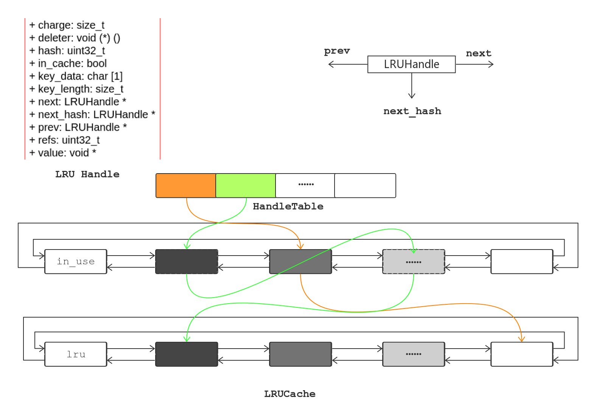

-  A LRU Cache is composed of a hash map(unordered_map in C++) and a list. 
-  Hash tables in leveldb is faster than g++ builtin hashtable

> 
	// util/cache.cc-66
	// We provide our own simple hash table since it removes a whole bunch
	// of porting hacks and is also faster than some of the built-in hash
	// table implementations in some of the compiler/runtime combinations
	// we have tested.  E.g., readrandom speeds up by ~5% over the g++
	// 4.4.3's builtin hashtable.

- Source files

> 
	include/leveldb/cache.h
	util/cache.cc

- The LRUCache is general-purpose cache, both actual types of the key and the value depend on upper layer users.
- When LRU Cache has no spare space to hold a new entry, the least recently used entry must be swapped out, users should provide deletion function for finalization, e.g. when a cache that manages opened fds discards an old fd to make room for a new fd,  the old fd shoud be closed.
- Both table cache and block cache are ShardedLRUCaches that have 16 LRUCaches  stored in an array.  the insertion operations work as follows:

>
- **step1**: Convert the key into uint32 by the hash function.
- **step2**: Use highest 4 bits to index LRUCache array whose size is 16.
- **step3**: Insert a entry into the chosen LRUCache. 

**TableCache**

- TableCache is globally unique and shared.

> 
	// db/db_impl.cc-116 DBImpl
	  table_cache_ = new TableCache(dbname_, &options_, table_cache_size);
> 
	  versions_ = new VersionSet(dbname_, &options_, table_cache_,
                             &internal_comparator_);

- Source files

> 
	db/table_cache.h
	db/table_cache.cc

- **key**: file numbers corresponding to SSTables.
- **value**: TableAndFile objects.

> 
	// db/table_cache.cc-14
	struct TableAndFile {
	  RandomAccessFile* file;
	  Table* table;
	};

- **deletion function**: DeleteEntry

> 
	// db/table_cache.cc-19
	static void DeleteEntry(const Slice& key, void* value) {
	  TableAndFile* tf = reinterpret_cast<TableAndFile*>(value);
	  delete tf->table;
	  delete tf->file;
	  delete tf;
	}

- Table is an in-core readonly SSTable, and TableBuilder is an in-core writable SSTable.
- TableCache invokes FindTable function to fetch target Table.`db/table_cache.cc-45`
- Table invokes Open function to load index block and filter block. `table/table.cc-38`

**Block Cache**

- There is only one shared block cache in global.

> 
	// db/db_impl.cc-98 Options
	  // Control over blocks (user data is stored in a set of blocks, and
	  // a block is the unit of reading from disk).
> 
	  // If non-NULL, use the specified cache for blocks.
	  // If NULL, leveldb will automatically create and use an 8MB internal cache.
	  // Default: NULL
	  Cache* block_cache;

- **key**: 16B, consists of cache_id of the table and offset of the block.

> 
	// table/table.cc-79 Table::Open
	    rep->cache_id = (options.block_cache ? options.block_cache->NewId() : 0);
> 
	// table/table.cc:182 BlockReader
	      char cache_key_buffer[16];
	      EncodeFixed64(cache_key_buffer, table->rep_->cache_id);
	      EncodeFixed64(cache_key_buffer+8, handle.offset());
	      Slice key(cache_key_buffer, sizeof(cache_key_buffer));

- **value**: Block `table/block.cc`

- **deletion function**: DeleteCachedBlock

> 
	// table/table.cc:151
	static void DeleteCachedBlock(const Slice& key, void* value) {
	  Block* block = reinterpret_cast<Block*>(value);
	  delete block;
	}


**TableCache::Get**

- Load the table specified by `file_number` into cache
- Then, invoke InternalGet to retrieve the target KeyValue

> 
	// db/table_cache.cc-105
	Status TableCache::Get(const ReadOptions& options,
	                       uint64_t file_number,
	                       uint64_t file_size,
	                       const Slice& k,
	                       void* arg,
	                       void (*saver)(void*, const Slice&, const Slice&)) {
	  Cache::Handle* handle = NULL;
	  Status s = FindTable(file_number, file_size, &handle);
	  if (s.ok()) {
	    Table* t = reinterpret_cast<TableAndFile*>(cache_->Value(handle))->table;
	    s = t->InternalGet(options, k, arg, saver);
	    cache_->Release(handle);
	  }
	  return s;
	}

**Table::InternalGet**

- First, search the key in `index block` and retrieve the BlockHandle of the target block.
- Then, abandon searching if the key not match with the filter.
- Finally, search the key in `data block`. 

> 
	// table/table.cc-226
	Status Table::InternalGet(const ReadOptions& options, const Slice& k,
	                          void* arg,
	                          void (*saver)(void*, const Slice&, const Slice&)) {
	  Status s;
	  Iterator* iiter = rep_->index_block->NewIterator(rep_->options.comparator);
	  iiter->Seek(k);
	  if (iiter->Valid()) {
	    Slice handle_value = iiter->value();
	    FilterBlockReader* filter = rep_->filter;
	    BlockHandle handle;
	    if (filter != NULL &&
	        handle.DecodeFrom(&handle_value).ok() &&
	        !filter->KeyMayMatch(handle.offset(), k)) {
	      // Not found
	    } else {
	      Iterator* block_iter = BlockReader(this, options, iiter->value());
	      block_iter->Seek(k);
	      if (block_iter->Valid()) {
	        (*saver)(arg, block_iter->key(), block_iter->value());
	      }
	      s = block_iter->status();
	      delete block_iter;
	    }
	  }
	  if (s.ok()) {
	    s = iiter->status();
	  }
	  delete iiter;
	  return s;
	}

**How to search key in data/index blocks?**

- Block::Iter::Seek
- binary search the restart interval which contains the key potentially.
- linear search the key in the target restart interval.

> 
	table/block.cc-165
	  virtual void Seek(const Slice& target) {
	    // Binary search in restart array to find the last restart point
	    // with a key < target
	    uint32_t left = 0;
	    uint32_t right = num_restarts_ - 1;
	    while (left < right) {
	      uint32_t mid = (left + right + 1) / 2;
	      uint32_t region_offset = GetRestartPoint(mid);
	      uint32_t shared, non_shared, value_length;
	      const char* key_ptr = DecodeEntry(data_ + region_offset,
	                                        data_ + restarts_,
	                                        &shared, &non_shared, &value_length);
	      if (key_ptr == NULL || (shared != 0)) {
	        CorruptionError();
	        return;
	      }
	      Slice mid_key(key_ptr, non_shared);
	      if (Compare(mid_key, target) < 0) {
	        // Key at "mid" is smaller than "target".  Therefore all
	        // blocks before "mid" are uninteresting.
	        left = mid;
	      } else {
	        // Key at "mid" is >= "target".  Therefore all blocks at or
	        // after "mid" are uninteresting.
	        right = mid - 1;
	      }
	    }
> 	
	    // Linear search (within restart block) for first key >= target
	    SeekToRestartPoint(left);
	    while (true) {
	      if (!ParseNextKey()) {
	        return;
	      }
	      if (Compare(key_, target) >= 0) {
	        return;
	      }
	    }
	  }
	  
- ParseNextKey:

> 
	// table/block.cc-226
	  bool ParseNextKey() {
	    current_ = NextEntryOffset();
	    const char* p = data_ + current_;
	    const char* limit = data_ + restarts_;  // Restarts come right after data
	    if (p >= limit) {
	      // No more entries to return.  Mark as invalid.
	      current_ = restarts_;
	      restart_index_ = num_restarts_;
	      return false;
	    }
> 	
	    // Decode next entry
	    uint32_t shared, non_shared, value_length;
	    p = DecodeEntry(p, limit, &shared, &non_shared, &value_length);
	    if (p == NULL || key_.size() < shared) {
	      CorruptionError();
	      return false;
	    } else {
	      key_.resize(shared);
	      key_.append(p, non_shared);
	      value_ = Slice(p + non_shared, value_length);
	      while (restart_index_ + 1 < num_restarts_ &&
	             GetRestartPoint(restart_index_ + 1) < current_) {
	        ++restart_index_;
	      }
	      return true;
	    }
	  }
	};

#### 3.2 NewIterator: Scan a batch of Key-Values

**Composite pattern**

```
Allows you to compose objects into tree structures to represent part-whole hierarchies. Composite pattern lets clients treat individual objects and compositions of objects uniformly. 
- Design Pattern:Elements of Reuseable Object-Oriented Software.
```

**Algebraic data type**

```
In computer programming, especially functional programming and type theory, an algebraic data type is a kind of composite type, i.e., a type formed by combining other types.
- https://en.wikipedia.org/wiki/Algebraic_data_type.
```

Iterator hierarchy conforms to composite pattern, the iterator is an example of algebraic data type.

**Iterator hierarchy**

- **Base iterator**

> 
	include/leveldb/iterator.h-23

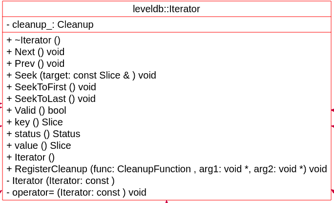

- **simple iterator**

> 
**MemTableIterator**

> 
- for iterating MemTable

> 
	db/memtable.cc-51

> 
**Block::Iter**

>  
- for iterating both data block and index block

> 
	table/block.cc-76

- **complex iterator**

> 
**TwoLevelIterator**

> 
- for iterating an in-core SSTable
- a TwoLevelIterator iterator is composed of 2 Block::Iter objects, one for iterating the index block, the other one for iterating the data block. 

> 
	table/two_level_iterator.cc-18

**MergingIterator**

> 
- for iterating internal keys in ascendent order.
- a MergingIterator is composed of Iterators.
- MergingIterator merges all of its child iterator as its own result.

> 
	// table/merger.cc-35
	  virtual void SeekToFirst() {
	    for (int i = 0; i < n_; i++) {
	      children_[i].SeekToFirst();
	    }
	    FindSmallest();
	    direction_ = kForward;
	  }

> 
	// table/merger.cc-59
	  virtual void Next() {
	    assert(Valid());
> 
	    // Ensure that all children are positioned after key().
	    // If we are moving in the forward direction, it is already
	    // true for all of the non-current_ children since current_ is
	    // the smallest child and key() == current_->key().  Otherwise,
	    // we explicitly position the non-current_ children.
	    if (direction_ != kForward) {
	      for (int i = 0; i < n_; i++) {
	        IteratorWrapper* child = &children_[i];
	        if (child != current_) {
	          child->Seek(key());
	          if (child->Valid() &&
	              comparator_->Compare(key(), child->key()) == 0) {
	            child->Next();
	          }
	        }
	      }
	      direction_ = kForward;
	    }
> 
	    current_->Next();
	    FindSmallest();
	  }

- all child seek to first key, and find the smallest key as the first key of MergingIterator.
- for Next invocation, move the current child iterator who has the smallest key forward, then find the next smallet key among all child iterators.

**DBIter**

- for iterating user keys of the db in lexicograhical order, in contrast to MergingIterator which iterates internal keys.
- DBIter invokes FindNextUserEntry skip deletion marker.

> 
	// db/db_iter.cc-146
	void DBIter::Next() {
	  assert(valid_);
> 	
	  if (direction_ == kReverse) {  // Switch directions?
	    direction_ = kForward;
	    // iter_ is pointing just before the entries for this->key(),
	    // so advance into the range of entries for this->key() and then
	    // use the normal skipping code below.
	    if (!iter_->Valid()) {
	      iter_->SeekToFirst();
	    } else {
	      iter_->Next();
	    }
	    if (!iter_->Valid()) {
	      valid_ = false;
	      saved_key_.clear();
	      return;
	    }
	    // saved_key_ already contains the key to skip past.
	  } else {
	    // Store in saved_key_ the current key so we skip it below.
	    SaveKey(ExtractUserKey(iter_->key()), &saved_key_);
	  }
> 	
	  FindNextUserEntry(true, &saved_key_);
	}
> 
	// db/db_iter.cc-173
	void DBIter::FindNextUserEntry(bool skipping, std::string* skip) {
	  // Loop until we hit an acceptable entry to yield
	  assert(iter_->Valid());
	  assert(direction_ == kForward);
	  do {
	    ParsedInternalKey ikey;
	    if (ParseKey(&ikey) && ikey.sequence <= sequence_) {
	      switch (ikey.type) {
	        case kTypeDeletion:
	          // Arrange to skip all upcoming entries for this key since
	          // they are hidden by this deletion.
	          SaveKey(ikey.user_key, skip);
	          skipping = true;
	          break;
	        case kTypeValue:
	          if (skipping &&
	              user_comparator_->Compare(ikey.user_key, *skip) <= 0) {
	            // Entry hidden
	          } else {
	            valid_ = true;
	            saved_key_.clear();
	            return;
	          }
	          break;
	      }
	    }
	    iter_->Next();
	  } while (iter_->Valid());
	  saved_key_.clear();
	  valid_ = false;
	}

- call RecordReadSample to trigger Compaction in every data retrieval of randomized size ranging from 0 to 2 MB.

>  
	// db/db_iter.cc-130
	inline bool DBIter::ParseKey(ParsedInternalKey* ikey) {
	  Slice k = iter_->key();
	  ssize_t n = k.size() + iter_->value().size();
	  bytes_counter_ -= n;
	  while (bytes_counter_ < 0) {
	    bytes_counter_ += RandomPeriod();
	    db_->RecordReadSample(k);
	  }
	  if (!ParseInternalKey(k, ikey)) {
	    status_ = Status::Corruption("corrupted internal key in DBIter");
	    return false;
	  } else {
	    return true;
	  }
	}

> 
	// db/db_iter.cc-1176
	void DBImpl::RecordReadSample(Slice key) {
	  MutexLock l(&mutex_);
	  if (versions_->current()->RecordReadSample(key)) {
	    MaybeScheduleCompaction();
	  }
	}


---

## Open

### DB is opened in 3 situations

1. create a new empty db.
2. Reopen a db that has terminates gracefully.
3. Recover a db to a consistency state from its last crash.
 
### DB::Open demo

> 
	#include <cassert>
	#include "leveldb/db.h"
> 
	leveldb::DB* db;
	leveldb::Options options;
	options.create_if_missing = true;
	leveldb::Status status = leveldb::DB::Open(options, "/tmp/testdb", &db);
	assert(status.ok())

### Customize DB by configuring leveldb::Options

`include/leveldb/options.h`

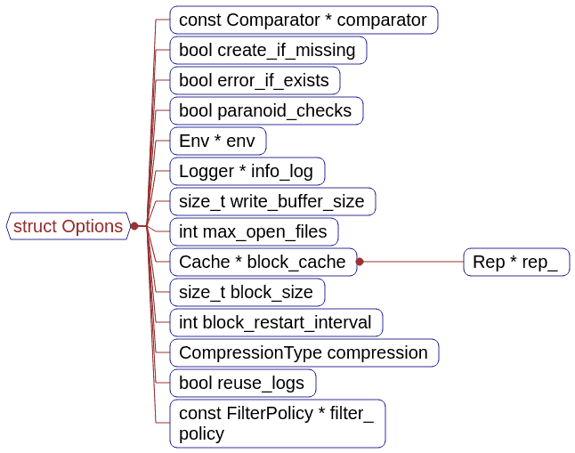

> 
- **`comparator`**: (default: bytewise comparator, lexicographical order)
user-defined function for comparing user keys.
- **`create_if_missing`**: (default: false)
similar to  O_CREAT for syscall open
- **`error_if_exists`**: (false)
smilar to O_EXCL|O_CREAT for syscall open
- **`paranoid_checks`**: (false)
do aggressive checking, failing to read block if crc checksum is mismatching. 
- **`env`**: (Env::Default(), PosixEnv)
encapsulate syscalls in different platforms, bridge design pattern, use PosixEnv in Linux, high portability.
- **`info_log`**: (NULL)
basedir/LOG, runtime trace info, not WAL.
- **`write_buffer_size`**:  (4MB)
maximum size in bytes of mem\_(MemTable), switch/rollup/cut WAL log when the size of MemTable approximates to write\_buffer\_size.
- **`max_open_files`**: (1000)
limit number of opened files.

> 
__table_cache [db/db_impl.cc:139:DBImpl]__

> 
		// db/db_impl.cc-139:DBImpl
		  // Reserve ten files or so for other uses and give the rest to TableCache.
		  const int table_cache_size = options_.max_open_files - kNumNonTableCacheFiles;
		  table_cache_ = new TableCache(dbname_, &options_, table_cache_size);

> 
- **`block_cache`**: (NULL)
block is unit of reading from disk, block_cache keep working set of blocks. user-specified

> 
__e.g.__

> 
	  #include "leveldb/cache.h"
> 
	  leveldb::Options options;
	  options.cache = leveldb::NewLRUCache(100 * 1048576);  // 100MB cache
	  leveldb::DB* db;
	  leveldb::DB::Open(options, name, &db);
	  ... use the db ...
	  delete db
	  delete options.cache;
> 
- **block_size**: (4KB)
maximum size of data block, switch a new one if the data block approximates to block_size.
- **block_restart_interval**: (16)
Number of keys between restart points for delta encoding of keys. data\_block/index\_block is split into several block\_interval in every `block_restart_interval` keys.
- **compression**: (kSnappyCompression)
compress block. kNoCompression(0x0)|kNoCompression(0x1). ~On a single core of a Core i7 processor in 64-bit mode, it compresses at about `250 MB/sec` or more and decompresses at about `500 MB/sec` or more. Typical compression ratios (based on the benchmark suite) are about 1.5-1.7x for plain text, about 2-4x for HTML, and of course 1.0x for JPEGs, PNGs and other already-compressed data. Similar numbers for zlib in its fastest mode are 2.6-2.8x, 3-7x and 1.0x, respectively.~ refer to [https://github.com/google/snappy/blob/master/README](https://github.com/google/snappy/blob/master/README)

> 
- **reuse_logs**: (false), EXPERIMENTAL
reuse existing log/MANIFEST files when re-opening a database.

> 
- **filter_policy**: (NULL)

> 
__e.g__

> 
	   leveldb::Options options;
	   options.filter_policy = NewBloomFilterPolicy(10);
	   leveldb::DB* db;
	   leveldb::DB::Open(options, "/tmp/testdb", &db);
	   ... use the database ...
	   delete db;
	   delete options.filter_policy;


### Implementation of DB::Open

#### step1: instantiate a DBImpl object

> 
	//db/db_impl.cc-1493 DB::Open
	  DBImpl* impl = new DBImpl(options, dbname);
 
configure fields of DBImpl and create an empty objects of TableCache and VersionSet.

#### step2: create db data directory and require file lock on LOCK file.

> 
		// db/db_impl.cc-276 DBImpl::Recover
		  env_->CreateDir(dbname_);
		  assert(db_lock_ == NULL);
		  Status s = env_->LockFile(LockFileName(dbname_), &db_lock_);
		  if (!s.ok()) {
		    return s;
		  }

#### step3: return on error in two cases: 1. no CURRENT file exists but create_if_missing flag is off, 2. CURRENT file exists but error_if_exists flag is on. fallthrough on success.

#### step4: prepare the first MANIFEST file and configure VersionSet object if creating a new db.

> 
- CURRENT file keeps "MANITEST-000001"
- MANIFEST-000001 file keeps a sentinel record that contains:
	- `prev_log_number_=0`
	- `log_number_=0`
	- `manifest_file_number_=1`
	- `next_file_number_=1`
	- `last_sequence_=0`


> 
	// db/db_impl.cc-176
	Status DBImpl::NewDB() {
	  VersionEdit new_db;
	  new_db.SetComparatorName(user_comparator()->Name());
	  new_db.SetLogNumber(0);
	  new_db.SetNextFile(2);
	  new_db.SetLastSequence(0);
	
	  const std::string manifest = DescriptorFileName(dbname_, 1);
	  WritableFile* file;
	  Status s = env_->NewWritableFile(manifest, &file);
	  if (!s.ok()) {
	    return s;
	  }
	  {
	    log::Writer log(file);
	    std::string record;
	    new_db.EncodeTo(&record);
	    s = log.AddRecord(record);
	    if (s.ok()) {
	      s = file->Close();
	    }
	  }
	  delete file;
	  if (s.ok()) {
	    // Make "CURRENT" file that points to the new manifest file.
	    s = SetCurrentFile(env_, dbname_, 1);
	  } else {
	    env_->DeleteFile(manifest);
	  }
	  return s;
	}
		
#### step5: replay current MANIFEST records on VersionSet object and set manifest_file_number_ to next_file_number and increment next_file number by 1. 

> 
	// db/version_set.cc-896 VersionSet::Recover

#### step6: scan the data directory,  return error if any files are missing

> 
	// db/db_impl.cc-318 DBImpl::Recover
	  std::vector<std::string> filenames;
	  s = env_->GetChildren(dbname_, &filenames);
	  if (!s.ok()) {
	    return s;
	  }
	  std::set<uint64_t> expected;
	  versions_->AddLiveFiles(&expected);
	  uint64_t number;
	  FileType type;
	  std::vector<uint64_t> logs;
	  for (size_t i = 0; i < filenames.size(); i++) {
	    if (ParseFileName(filenames[i], &number, &type)) {
	      expected.erase(number);
	      if (type == kLogFile && ((number >= min_log) || (number == prev_log)))
	        logs.push_back(number);
	    }
	  }
	  if (!expected.empty()) {
	    char buf[50];
	    snprintf(buf, sizeof(buf), "%d missing files; e.g.",
	             static_cast<int>(expected.size()));
	    return Status::Corruption(buf, TableFileName(dbname_, *(expected.begin())));
	  }

#### step7: recover data from log files

> 
	// db/db_impl.cc-343 DBImpl::Recover
	// Recover in the order in which the logs were generated
	  std::sort(logs.begin(), logs.end());
	  for (size_t i = 0; i < logs.size(); i++) {
	    s = RecoverLogFile(logs[i], (i == logs.size() - 1), save_manifest, edit,
	                       &max_sequence);
	    if (!s.ok()) {
	      return s;
	    }
> 	
	    // The previous incarnation may not have written any MANIFEST
	    // records after allocating this log number.  So we manually
	    // update the file number allocation counter in VersionSet.
	    versions_->MarkFileNumberUsed(logs[i]);
	  }
	  
#### step8: reuse the last log file/MemTable or create new a log file/MemTable

> 
	// db/db_impl.cc-453 DBImpl::RecoverLogFile
	  // See if we should keep reusing the last log file.
	  if (status.ok() && options_.reuse_logs && last_log && compactions == 0) {
	    assert(logfile_ == NULL);
	    assert(log_ == NULL);
	    assert(mem_ == NULL);
	    uint64_t lfile_size;
	    if (env_->GetFileSize(fname, &lfile_size).ok() &&
	        env_->NewAppendableFile(fname, &logfile_).ok()) {
	      Log(options_.info_log, "Reusing old log %s \n", fname.c_str());
	      log_ = new log::Writer(logfile_, lfile_size);
	      logfile_number_ = log_number;
	      if (mem != NULL) {
	        mem_ = mem;
	        mem = NULL;
	      } else {
	        // mem can be NULL if lognum exists but was empty.
	        mem_ = new MemTable(internal_comparator_);
	        mem_->Ref();
	      }
	    }
	  }
> 
	  if (mem != NULL) {
	    // mem did not get reused; compact it.
	    if (status.ok()) {
	      *save_manifest = true;
	      status = WriteLevel0Table(mem, edit, NULL);
	    }
	    mem->Unref();
	  }

> 
	// db/db_impl.cc-1499 DB::Open
	  if (s.ok() && impl->mem_ == NULL) {
	    // Create new log and a corresponding memtable.
	    uint64_t new_log_number = impl->versions_->NewFileNumber();
	    WritableFile* lfile;
	    s = options.env->NewWritableFile(LogFileName(dbname, new_log_number),
	                                     &lfile);
	    if (s.ok()) {
	      edit.SetLogNumber(new_log_number);
	      impl->logfile_ = lfile;
	      impl->logfile_number_ = new_log_number;
	      impl->log_ = new log::Writer(lfile);
	      impl->mem_ = new MemTable(impl->internal_comparator_);
	      impl->mem_->Ref();
	    }
	  }
		

#### step9: create a new MANIFEST file if reuse_logs flag is off or the old MANIFEST file is too large. 

> 
	// db/version_set.cc-1007 VersionSet::Recover
	    // See if we can reuse the existing MANIFEST file.
	    if (ReuseManifest(dscname, current)) {
	      // No need to save new manifest
	    } else {
	      *save_manifest = true;
	    }

> 
	// db/version_set.cc-1018 VersionSet::ReuseManifest
	bool VersionSet::ReuseManifest(const std::string& dscname,
	                               const std::string& dscbase) {
	  if (!options_->reuse_logs) {
	    return false;
	  }
	  FileType manifest_type;
	  uint64_t manifest_number;
	  uint64_t manifest_size;
	  if (!ParseFileName(dscbase, &manifest_number, &manifest_type) ||
	      manifest_type != kDescriptorFile ||
	      !env_->GetFileSize(dscname, &manifest_size).ok() ||
	      // Make new compacted MANIFEST if old one is too big
	      manifest_size >= kTargetFileSize) {
	    return false;
	  }
> 	
	  assert(descriptor_file_ == NULL);
	  assert(descriptor_log_ == NULL);
	  Status r = env_->NewAppendableFile(dscname, &descriptor_file_);
	  if (!r.ok()) {
	    Log(options_->info_log, "Reuse MANIFEST: %s\n", r.ToString().c_str());
	    assert(descriptor_file_ == NULL);
	    return false;
	  }
> 	
	  Log(options_->info_log, "Reusing MANIFEST %s\n", dscname.c_str());
	  descriptor_log_ = new log::Writer(descriptor_file_, manifest_size);
	  manifest_file_number_ = manifest_number;
	  return true;
	}

> 
	// db/db_impl.cc-1514 DB::Open
	  if (s.ok() && save_manifest) {
	    edit.SetPrevLogNumber(0);  // No older logs needed after recovery.
	    edit.SetLogNumber(impl->logfile_number_);
	    s = impl->versions_->LogAndApply(&edit, &impl->mutex_);
	  }

> 
	// db/version_set.cc-834 VersionSet::LogAndApply
	  // Initialize new descriptor log file if necessary by creating
	  // a temporary file that contains a snapshot of the current version.
	  std::string new_manifest_file;
	  Status s; 
	  if (descriptor_log_ == NULL) {
	    // No reason to unlock *mu here since we only hit this path in the
	    // first call to LogAndApply (when opening the database).
	    assert(descriptor_file_ == NULL);
	    new_manifest_file = DescriptorFileName(dbname_, manifest_file_number_);
	    edit->SetNextFile(next_file_number_);
	    s = env_->NewWritableFile(new_manifest_file, &descriptor_file_);
	    if (s.ok()) {
	      descriptor_log_ = new log::Writer(descriptor_file_);
	      s = WriteSnapshot(descriptor_log_);
	    }
	  }

#### step10: delete obsolete files and trigger background compaction

#### step11: return the DBImpl object for manipulating leveldb

----

### graceful termination

set `DBImpl::shutting_down_` to a non-NULL value

> 
	// db/db_impl.cc-147
	DBImpl::~DBImpl() {
	  // Wait for background work to finish
	  mutex_.Lock();
	  shutting_down_.Release_Store(this);  // Any non-NULL value is ok
	  while (bg_compaction_scheduled_) {
	    bg_cv_.Wait();
	  }
	  mutex_.Unlock();
> 	
	  if (db_lock_ != NULL) {
	    env_->UnlockFile(db_lock_);
	  }
> 	
	  delete versions_;
	  if (mem_ != NULL) mem_->Unref();
	  if (imm_ != NULL) imm_->Unref();
	  delete tmp_batch_;
	  delete log_;
	  delete logfile_;
	  delete table_cache_;
> 	
	  if (owns_info_log_) {
	    delete options_.info_log;
	  }
	  if (owns_cache_) {
	    delete options_.block_cache;
	  }
	}

The backgroud compaction thread  checks `shutting_down_` before it goes ahead and stops compacting on its own if `shutting_down_` is set. 

DBImpl dtor waits for the compaction thread to cease, then release the file lock and memory, close files.

### RepairDB

> 
	// db/repair.cc-456
	Status RepairDB(const std::string& dbname, const Options& options) {
	  Repairer repairer(dbname, options);
	  return repairer.Run();
	}
		
> 
	// db/repair.cc-70		
	  Status Run() {
	    Status status = FindFiles();
	    if (status.ok()) {
	      ConvertLogFilesToTables();
	      ExtractMetaData();
	      status = WriteDescriptor();
	    }   
	    if (status.ok()) {
	      unsigned long long bytes = 0;
	      for (size_t i = 0; i < tables_.size(); i++) {
	        bytes += tables_[i].meta.file_size;
	      }   
	      Log(options_.info_log,
	          "**** Repaired leveldb %s; "
	          "recovered %d files; %llu bytes. "
	          "Some data may have been lost. "
	          "****",
	          dbname_.c_str(),
	          static_cast<int>(tables_.size()),
	          bytes);
	    }   
	    return status;
	  }
	  
**key points**

- scan child files in db data directory, and classify these files into logs, SSTables and MANIFESTs.
- convert log files into SSTable files.
- iterate the key&value of each SSTable, try the best to recovey the SSTable on error.
- Add all valid SSTables info level-0 and write manifest.