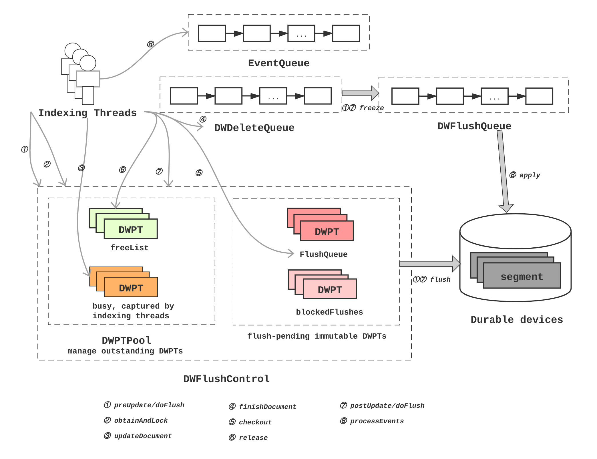
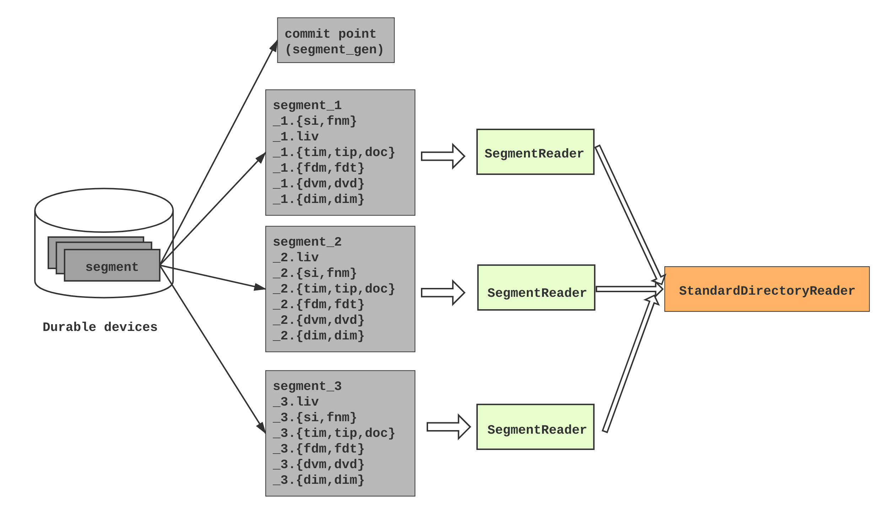
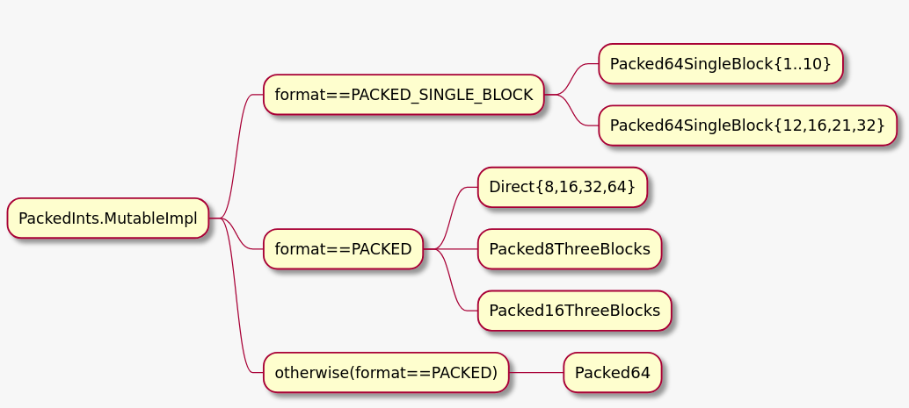
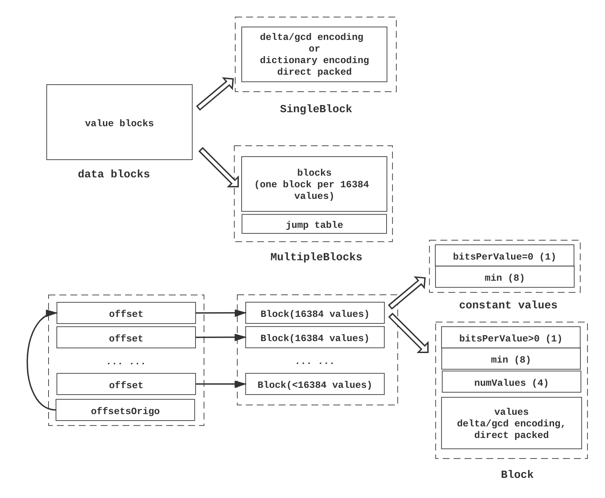
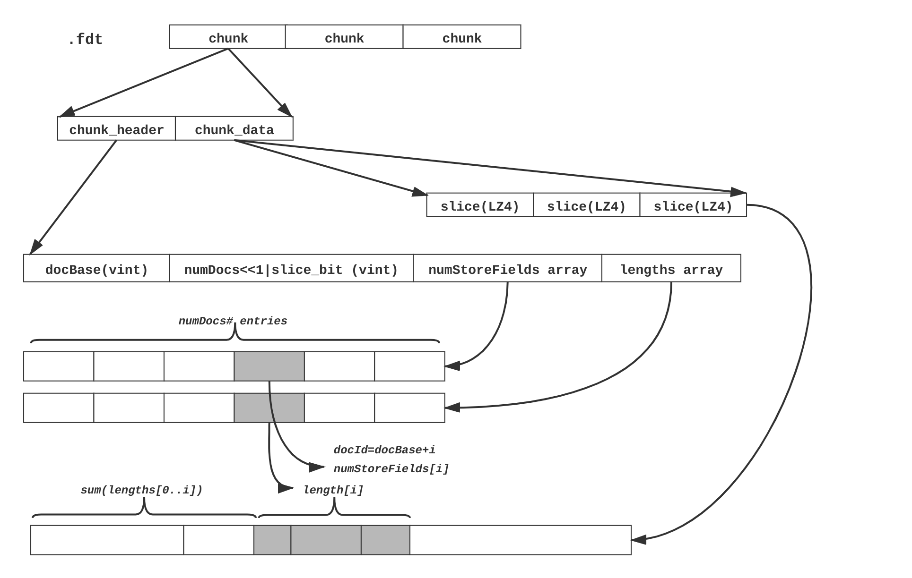

# Lucene的部分源码阅读
# BY satanson@DorisDB

- 本篇文档来源: https://github.com/satanson/cpp_etudes/blob/master/docs/lucene_chewsrc_zh.md
- 中文版PDF下载地址: https://github.com/satanson/cpp_etudes/blob/master/docs/lucene_chewsrc_zh.pdf
- 英文版PDF下载地址: https://github.com/satanson/cpp_etudes/blob/master/docs/lucene_chewsrc_en.pdf

----
## 目录
1. **动机(Motivation) & 工作负载(Workload)**
2. **数据模型(Data Model)**
3. **内存和磁盘存储(In-memory & On-disk Storage)**
4. **事务(ACID)**
5. **空间/读/写放大(Space/Read/Write Amplification)**
6. **更新机制(Update mechanism)**
7. **其他(Misc)**

----

##  **动机(Motivation) & 工作负载(Workload)**

### 动机(Motivation) 

#### 1. 收录非结构化和半结构化的数据集
- 系统服务使用日志库诸如log4j, glog等打印的日志.
- 用户生产的文档内容.

#### 2. 相应如下查询
- 文档的给定字段匹配到查询词, 返回匹配的文档.
- 对文档的某些字段进行聚合或者排序处理.
- 返回匹配的文档的某些字段.

----

###  工作负载(Workload)

#### 1. 作为文档或日志数据库而使用
- 所处理的数据集有一个一个的文档构成.
- 全文检索.
- source filtering: 过滤和返回字段的子集合.

#### 2. 支持的操作类型
- insert/update/deletion
- query

#### 3. 数据划分
- 随着新文档不断被收录, 数据集持续变大.
- 高效查找所涉及的部分数据, 而非全量数据.

#### 4. 聚合和排序:
- 可以对半结构化文档的某些字段做排序和聚合处理.

----

### ElasticSearch和Lucene关系
- ElasticSearch是一个满足上述开发动机和workload的文档数据库.
- Lucene是作为ES心脏, 是ES的本地存储引擎. 
- Lucene至于ES, 如同RocksDB 至于ArangoDB.
- ElasticSearch专注于分布式系统的partitioning&replication.
- ES中一个Lucene实例管理一个分片副本.
- Lucene对所述分片副本的文档集合进行编码, 存储和构建索引.
- ES将query拆解成一系列subquery, 分发给所涉及的分片副本处理, 然后聚拢和合并结果.

----

## **数据模型(Data Model)**

### Index
- ES中的Index/document/field, 可类比于关系数据库的table/tuple/column.
- 字段(Field)的内容经过分析器分词处理, 建立倒排索引. 
- 词项(term):  是一个二元组(字段名, 词,  也就是说, 两个词相同, 但来自不同字段,  认为是两个不同的词项. 后文直接用token和term称呼词和词项.
- ES和Lucene中都有Index概念, 但两者含义不同. ES中, index被划分成分片, 每个分片复制成多个副本. 而Lucene中,  Index就是ES中的分片副本.

### Index Pattern
- ES中的Index有名字.
- 而index pattern就是Index名字的匹配模式(glob).
- 举个例子; 加入一小时切一次日志, 每个小时的日志为一个Index, 现有的Index有 `log_2020_08_22_00`, `log_2020_08_22_01`, ..., `log_2020_08_22_23`;  则Index pattern `log_2020_08_22_*` 会匹配所有日志.
- 可以对一个Index pattern发起一个查询. 

### 和DorisDB的对比
- index pattern相当于DorisDB的一个表;
- index相当于DorisDB的表中随时间滚动的partition;
- index的分片相当于DorisDB中tablet, 一个partition的数据可以散列到多个tablet中;
- index的分片副本(即lucene index)也相当于DorisDB的tablet副本.

### Document


### 字段类型
- string类型: 
	- text: 被分词, 不能用于doc_values,  可以做全文检索;
	- keyword: 不被分词, 默认做doc_values, 做聚合是可以看成是维度列, 用于过滤数据(selection);
	- wildcard: ngram, wildcard查询.
- numeric类型: byte, short, integer, long, float, double;
- date time: long;
- geo类型: numeric类型的数组;

### index-enabled fields
- text类型字段会构建倒排索引.
- 索引包括: term dictionary和posting list.
- 保存term的position, position data (offset, payload)用于proximity query, phrase query和highlight.
- 保存norms和term vector用于打分和排名
### stored fields

- 行存, 行式布局;

- Lucene中被索引字段默认不会被当做store field存储, 因此没法获取和导入时一字不差的文档.
- ES使用_source字段做store fields,  存储整个文档,  因此依然可以获取一字不差的文档.
- store fields用于source filtering: 查询时只返回一部分感兴趣的字段，而非全部字段.  因此source filtering类似关系数据库的projection操作.
### doc values
- 列存, 列式布局;
- 表示维度的字段: keyword类型用作doc values;
- 表示度量的字段: numeric类型用作doc values;
- 用于排序操作: 用户指定一组排序字段;
- 数据类型在Lucene内部都按照long类型存储和编码, 包括浮点型.

### points
- 使用kd-tree存储;
- 用于范围查询(range query);
- 用于地理查询(geo query).

## 内存和磁盘存储(In-memory & On-disk Storage)

### Lucene vs LevelDB  vs HBase

| **本地存储引擎** | **内存结构**                                | **磁盘结构**   | 更新操作                                                     | Flush/Compaction                                             |
| ---------------- | ------------------------------------------- | -------------- | ------------------------------------------------------------ | ------------------------------------------------------------ |
| Lucene           | DWPT<br/>DocumentsWriterPerThread           | Segment        | multi-versioned;<br/>record updates in DWDeleteQueue; <br/>apply updates to segment at the proper moment;<br/>commit point with largest generation wins. | concurrent flush/compaction;<br/>indexing threads help FULL_FLUSH thread; <br/>background compaction;<br/>TieredMergePolicy;<br/>LogMergePolicy;<br/>size-trigger. |
| LevelDB          | MemTable                                    | SSTable, log   | multi-versioned;<br/>append new entry;<br/>max LSN wins.     | serial flush/compaction;<br/>single background compaction thread;<br/>leveled compaction;<br/>size-trigger/seek-trigger. |
| HBase            | MemStore<br/>ConcurrentSkipListMap          | HFile, HLog    | multi-versioned;<br/>append new entry;<br/>max sequenceId wins. | concurrent flush/compaction;<br/>in-memory compaction;<br/>major compaction;<br/>size-based compaction. |


### 从IndexWriter视角看Lucene的写入



### 从IndexReader视角看Lucene的读出



## 事务(ACID)
###  原子性(Atomicity)

- Lucene自身无WAL, 内嵌Lucene做本地存储引擎的系统可提供WAL.
- ES使用**translog** 保证原子性和持久性;
- Lucene使用函数IndexWriter::commit提交最近的数据;
- 未提交数据经过FULL_FLUSH后, 对读操作可见;
- 一批更新或者插入操作的生效保证all-or-nothing.

### 一致性(Consistency)

- 导入一个文档时, 如果inverted index, store fields, doc values, points任何一部分失败, 该文档会被删除.
- 无主键, 因此没有主键约束;
- 也没有唯一键约束.
- 当然用户可自行构造唯一键模拟主键.

### 隔离性(Isolation)

- 在WDPT内,  会按照文档导入的次序分配开始为0的连续单调递增的docId.
- 多个WDPT的操作通过DWDeleteQueue同步,  t这些操作竞争DWDeleteQueue管辖的单调递增的seqNo.
- docId的删除和doc_values的更新操作,  需要应用于外部的segments,  这些更新操作通过DWFlushQueue同步,  按照seqNo的次序生效;
- pending更新操作和持久化的segment都拥有单调递增的generation number, 更新只能应用于generation number比其自身要小的segment.

### 持久性(Durability)

- 落盘函数IndexWriter::commit, 操作很重;
- 对index目录执行fsync;
- 对目录下的新修改文件执行fsync;
- 写文件保持segment info和commit point , 然后执行fsync;
- ES使用translog做数据持久化, 所以才采用full flush代替Index::commit方法最近的数据对读可见, 而IndexWriter::commit用于checkpoint和日志prune.

## **空间/读/写放大(Space/Read/Write Amplification)**

### 关键点

- 使用精湛的编码和压缩技术节省空间, 并且使读写更高效.
- 小文件合并成大文件, 回收掉已删除文件, 提升局部性.
- 使用带缓冲的读写操作, 平摊IO代价. 
- 读线程和写线程都可以做full flush, 当前做索引构建的线程可以帮助正在进行的full flush.
- 删除操作为标记操作, 只修改存活文档的bitmap结构(.liv), 不修改posting list, doc values,  store fields等.

### 基本编码

#### PackedInts



- 整数取值较小时, 采用少量bit, 把原来的一组整数挤压在一起, 消除间隙和填充, 以节省空间.
- PackedInts不同于可变整数编码, 因为一组值编码后的位数是相同的, 在编码前, 已经采用了其他方法显著地降低了整数的位数. PackedInt是Lucene的基础编码.
- Packed64SingleBlock系列:  编码后的值不能横跨两个long的边界. 因此末位的空间可能会浪费.  比如5-bit integer, 只能在int64_t中放置12个, 末尾的4 bit没有用到. 
- Direct系列:  没有bit浪费, 只支持{8,16,32,64}-bit的整数;
- PackedThreeBlocks系列: 没有bit浪费, 只支持{24, 48}-bit的整数;
- Packed64: 没有bit浪费, 编码后的值可跨越两个long的边界. 比如5-bit integer, 在int64_t中放置12个后, 末尾的4 bit和下一个int64_t的头部1 bit存储下一个5-bit integer.

####  Delta编码

- 先求一组值的最小元, 然后求出每个元和最小元的增量:

```
min = min(values)
values = [ x - min for x in values]
```

- 对一组增量使用PackedInt编码.
- 适用于取值区间宽度较窄的情形.

#### Monotonic  delta 编码

- 输入的一组数据有序或近似有序;
- 求出输入数据的斜率dy/dx, 然后每个元计算: y - Δy = y - (dy/dx)Δx;
- 然后做delta编码;

```
slope = (values[n-1] - values[0])/(n-1)
values = [ values[i]-i*slope for i in range(0,len(values))]
min = min(values)
values = [ x - min for x in values]
```

- 对上述计算结果做PackedInt编码;
- 一组长度可变字符串紧密存储在一个字节数组中, 使用offset数组描述字符串开始位置.  monotonic delta编码适用于对offset数组的编码.

#### Delta/gcd 编码

- 求取输入数据的最小值和最小公倍数, 然后减去最小值，除以公倍数;

```
min = min(values)
gcd = gcd(values)
values = [ (x - min)/gcd for x in values]
```

- 对上述计算结果做PackedInt编码;
- 当输入数据表示的是粗粒度的date/time时,  能够从中收益.  比如用以毫秒为单位, 表示日期,  则gcd为86400000.

#### Dictionary 编码

- 输入数据的不重复值个数比较少(<=255)时, 先排序, 使用排序后的序号代替原始值;
- 保存序号和原始值的映射表;
- 对替换后的数据采用PackedInt编码.

####  Bitmap 编码

- 数据数据为稠密单调递增序列, 稠密是指两个相邻值之间的间隙比较小, 几乎连续单调递增;
- 置1的bit的序号和原始数组一一对应.

#### Binary编码

- 输入数据为clob或者blob数组;
- 把blob逐个逐字节追加到byte数组或者OutputStream末尾, 相邻的两个blob之间无填充, 也无间隙, 紧紧地贴在一起;
- 使用offset数组记录每个blob在byte数组中的偏移位置;
- offset数组采用monotonic delta编码.

#### Sorted string编码

- 把string数组按照词典序排序, 使用的string的delta编码, 类似LevelDB的sorted string的delta编码;
- 用拍完序的序号代替原来string; 
- 用数值编码方法对序号数组进行编码.

----


### Doc values

- Lucene无主键, 虽可使用唯一ID模拟主键, 然主键非clustering;
- 每个segment有自己私有的docId空间, 可使用docId做查找key;  查询时, 首先使用一组词项查找倒排索引, 得到一组docId,  然后使用docId获取doc_values或者stored fields. 
- 列式布局: 在一个DWPT或者segment中,  启用`doc_values`的同一个字段的来自所有文档的取值,  作为一个整体被编码和存储在一起,   所有的启用doc_values的字段的存储在一个文件中. 
- 对doc values编码时,  输入数据为两个等基数组, 第一个为docId数组, 另一个为value数组.  如果文档中不包含目标字段, 则docId不出现在docId数组中; docId数组单调递增且稠密, 因为这里的docId是segment或者DWPT所私有的, 因此可以保证单调递增性.  而value数组的内容是目标字段在相应docId所指向的文档中的字段取值.
- 在内存中, docId数组一律采用bitmap编码; 而value数组的编码取决于目标字段的数据类型. 

#### Numeric类型内存布局

- value数组: 采用delta编码.

  

#### Binary类型内存布局

- values数组:  采用binary编码, 但是使用length数组代替了offset数组.

  

#### Sorted类型内存布局
- values数组:  docId的编码保持同其他类型, 考虑到后续持久化存储时需要采用sorted string编码,  此刻需要在内存中

  

- On-disk layout is a little complex.

#### Numeric类型磁盘格式

- .dvm和.dvd分别保持per-field的doc values的元数据和数据, 两者一一对应.  

  

- per-field doc values由docId blocks, docId jump table, value blocks, value jump table的四部分构成, 其中jump table可以看成是blocks的查找表.

- per-field metadata包含field自身信息, 对应的per-field doc values四部分的偏移和长度信息, 还有编码参数.

  

- 当所有document都不含该doc values字段, 则不必记录docId blocks和value blocks.

- 当所有document都含有该doc values字段, 则不必记录docId blocks, 只保存values blocks.

- 只有当部分document有doc values字段, 部分没有doc values字段时, 此时需要记录docId blocks.

- docId的存储采用roaring bitmap, docId的取值范围为0 ~ 2147483647, 可用32-bit的整数表示,  将docId分成高低各16-bit两部分,  其中高16-bit为docId block的编号,  每个docId block根据归属docId的稀疏程度, 采用不同的编码技术. 如果docId block中无docId存在, 则不存储. 显然当bitmap比较稀疏或者在某个区间非常稠密时, 这种方法比扁平的bitmap, 更节省存储空间.


- DocId jump table是docId blocks的索引表,  索引表的表项有两部分构成, 第一部分记录docId block的编号, 第二部分为block偏移量, 因为所有的docId block紧挨存储, 所以通过偏移量, 可以找到对应block的起始位置.  前文已经说过, block自身也经过编码, 需要从起始位置读取并解码.  索引表的最后一项为编号32767的block, 该block中只唯一记录了docId 2147483647, 该表项和docId是哨兵, 查找或者scan这个roaring bitmap时, 触及哨兵说明已经到了末尾. 事实上lucene处理document构建索引时, 前文已经提到docId为DWPT或者segment所私有,  并且从0增长, 实际上, 最大docId和2147483647之间有很大距离, 这种情况下, 最大docId所属block的对应的索引表项和末位哨兵表项相邻, 如图中7和32767,  而8, 9, ..., 32766并不额外占用表项.  然后0号表项和最大表项之间所有表项都存在, 如果其中某一个表项, 并没有实际的docId block与其对应, 则该表项指向下一个真实存在的docId block, 如图中编号为1, 2, 3, 4的表项都指向了编号4的docId blocks. 这样做的好处时, 用某个block编号查找索引表时, 如果表项所记录的编号比带查找的编号大, 则说明该block不存在. 而scan时, 显然可以快速跳过这些docId block不存在的表项. 所以这种方法非常巧妙.

- 查找时, 先找block编号, 然后使用docId的低16-bit在block内查找, 其查找方法屈居于docId block的编码方法.

- docId block编码:  首先根据block内的docId的基数, 分两种情况: 1. 基数小于4096, 认为block稀疏(6.25%) , 则使用有序数组存储docId的低16-bit. 显然读取时可以使用二分查找; 2. 基数不小于4096, 则采用稠密编码, 该编码本质上采用8KB bitmap, 可容纳65536 bit.  显然bitmap可快速判断某个docId是否存在, 但不方便遍历, 因此采用额外的rank数组,  rank数组总共128项, 16-bit, 大端编码. 将bitmap的65536个bit分成128个512-bit, 和rank数组元素一一对应.  rank数组的元素记录从第0个512-bit到当前512-bit的范围内的置位个数. rank数组可用来跳过全部置0的512-bit, 或者判断某个范围是否有docId存在.

- 不管是稀疏编码还是稠密编码, 要找到指定docId对应的doc values, 显然无法通过docId自身来锁定doc values, 而是需要根据docId找到序号, 然后用序号锁定doc values, 稀疏编码的有序数组和稠密编码的rank数组, 都可以加快序号计算.

  

- Numeric类型的doc values编码同样比较精细:  如果不同取值的个数不超过255并dictionary编码比delta/gcd编码在空间上更加高效, 则采用dictionary编码, 不然则使用delta/gcd编码. 

- 采用delta/gcd编码时, 还需要比对整体编码成一个block和多block编码的空间效率, 当后者可节省10%的空间, 则采用多block编码. 所有编码的范围, 提升编码效率, 基于假设:  在小范围内, 数据的起伏变化比较平摊.



#### Binary类型磁盘格式

  - 和Numeric编码类似, docId处理方法相同;
  - 内存格式中Blob写入到 .dvd文件中;
  - 内存编码中采用长度数组, 写入磁盘时, 转换为offset数组, offset数组采用monotonic delta编码.

#### Sorted类型磁盘格式.

- 和Numeric编码类似, docId处理方法相同
- Sorted类型用于低基数的字符串类型,  在内存布局中, 已经通过Hash table建立了词典,  对字符串采用了词典编码. 词典初始建立时,  每个字符串的编码值等同于首次到达词典的序数. 
- 词典编码一般需要存储编码后的值和字符串的映射关系, Lucene在此处做得很巧妙, 将字符串按词典序(lexicographical)排序, 然后每个字符串重新映射到排序后的序数(cardinal), 如此, 则不必存储序数, 而有序的字符串采用LevelDB中的sorted string的delta编码, restart interval的宽度也是16. 字符串排序和编码重映射的实现也非常巧妙, 只需对内存布局中hash slot table做排序即可.
- doc values经过词典编码已经转换为整数数组, 再次使用PackedInts.Direct编码;
- 为了加快查找给定的字符串,   对字符串建立了索引.

#### 其他doc values类型

- Sorted numeric: 数值类型的多值字段.
- Sorted set:  字符串类的多值字段.

----

### Stored fields

- 前文提到, 文档的某些字段倒排索引化了, 但没有原样存储, 因此无法获得ingest之前的内容.
- stored fields就是解决这个问题的, 字段为stored fields, 则会原样存储.
- ES做ingest的时候, 给待处理文档添加了名为_source的store field, 用来原样保存整个原始文档. 
- Stored fields恰恰可以和doc values做对比, 它采用了行式布局,  每个文档的全体store fields聚簇在一起, 存储于.fdt文件中;
- 每个store field对应的存储为fielddata, fielddata包含了field no, type和data, 分别对应字段的编号, 类型信息和实际的数据.
- 当一批文档的store fields存储的字节长度超过16KB或者数量超过128个, 则形成一个chunk.
- chunk分割成16KB的slice, 每个slice单独采用LZ4编码. 


- 图中的每个chunk有一个chunk_header, 存储元数据. 
- 元数据包括: 
  - 变长整数编码的docBase, 该chunk中的第一个文档的docId;
  - 文档的数量numDocs;
  - 该chunk是否做了slicing; 
  - numStoreFields和lengths数组, 每个数组的元素数量为numDocs, 保存属于这个chunk的文档的store fields数量和实际的存储长度. 即便文档不含store fields, 依然在这两个数组中占据一项. 



- 实际的store fields数据保持在.fdt文件中, 为了加快访问速度, 使用.fdx文件保存查找目标chunk的索引信息.
- .fdt中的chunk和.fdx中的索引项一一对应; 索引项的内容为对应chunk的docBase和在.fdt中offset构成的二元组, 但分别保存在两个数组中: docBases数组和offset数组,  分开保存的目的是为了对两个数组分别采用monotonic delta编码.
- 每1024个索引项构成一个block,  按block对索引项进行编码, 以节省空间.


----

### 其他布局(略)

- Points: kd-tree;
- Inverted index: term directory and posting list.


----

## 更新机制

### 支持的更新操作类型

- 删除匹配每个query的文档;
- 删除匹配每个term的文档;
- 更新匹配每个term的一组文档的numeric-typed和binary-typed的doc_values;
- 一批上述相同类型的操作;
- 更新操作和插入操作;
- 更新操作和一批插入操作.

### 更新生效

- 已经执行apply的update操作对NRT(near real-time)Index Reader可见,  但掉电可能会出现lost updates现象.
- IndexWriter::commit函数对更新执行apply操作,  然后把更新flush到page cache中, 最后调用fsync. 经过这一番处理的更新可容忍掉电故障. 

### 操作的可见性升序排列
- updateDocuments/updateDocument:  添加更新记录到DWDeleteQueue中, 对当前的DWPT不可见,  也尚未应用到segment.
- deleteDocuments/updateDocValues: 对当前DWPT不可见, 更新记录被异步地应用于segment.
- tryUpdateDocValue/tryDeleteDocument: 对当前DWPT不可见, 更新记录被同步地应用于segment.
- 打开或重新打开NRT IndexReader: 调用flushAllThreads将DWPT刷入持久化设备(但fsync未调用),把所有的处于DWDeleteQueue的更新记录应用于所有的segment, 写存活文档的bitmap(依赖于writeAllDeletes的实际取值) , doc values的更新也会写入磁盘(fsync未调用); 当前DWPT的对外可见. 
- IndexWriter::commit: 导出所有DWPT到持久化设备, 应用所有的更新记录并写入设备. 产生一个commit point, 并且刷数据到磁盘, 最后调用了fsync; 本质上相当于做了一次checkpoint.

### NRT IndexReader
- 在ES中, 写入和更新操作在调用InternalEngine::refresh函数之后, 对读可见.  这个函数是通过重新open NRT IndexReader来实现的;
- 打开或者重现打开一个NRT IndexReader会导致一次full flush(即调用flushAllThreads).  处于DWDeleteQueue中更新操作会分发给DWFlushQueue, 然后DWFlushQueue将更新操作应用于每个磁盘segment所对应的ReadersAndUpdates对象上, 最后每个ReadersAndUpdates中的delete操作和doc_values的更新操作被写入持久化设备. 

## 其他

- 在lucene中, docId不稳定而且segment或DWPT所私有,  因此没法通过指定的docId来删除目标文档.
- 不管是删除操作还是更新操作,  都可能是跨segment的操作.  所有全局性的单例DWDeleteQueue和 DWFlushQueue 用来收集来自indexing thread的更新操作. 最后把这些操作以一个一致的顺序, 应用到全体目标segment.
- 修改存活文档的bitmap后, 删除操作就会生效; 而标记死亡的docId对应的文档在后续的merge操作中完成回收.